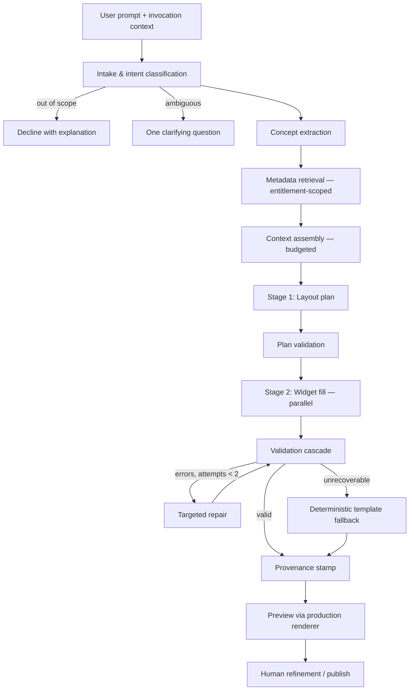

# AI Architecture

Status: **Approved; pipeline implemented against mocked metadata and a simulated provider**
Related: [`architecture-review.md`](./architecture-review.md) · [`backend-architecture.md`](./backend-architecture.md) · [`security-architecture.md`](./security-architecture.md)
Implementation record: [`../docs/AI-GENERATION-WORKFLOW.md`](../docs/AI-GENERATION-WORKFLOW.md)
Supersedes: [`ai-generation-architecture.md`](./ai-generation-architecture.md)

> **Implementation status.** §2–§6 are built in `libs/generation/` and `libs/catalog/`, with a
> rules-based `SimulatedModelProvider` behind the `ModelProvider` port. §7 (evaluation harness)
> and the real-model integration are not. Building it corrected five things this document had
> wrong; each is marked **[revised by implementation]** inline, and all five are recorded with
> their symptoms in the implementation record.

---

## 1. Framing Decisions

Three decisions constrain everything that follows. They are stated first because the rest of the design is only coherent given them.

### 1.1 The AI writes artifacts; it does not serve requests

**All v1 AI is design-time.** The model produces a page definition — an artifact a human reviews, refines, and publishes. Rendering that definition afterwards involves no model call at all.

This resolves the ambiguity identified in the review (§G5), and its consequences are large and entirely positive:

| Property | Because generation is design-time |
|---|---|
| Governance | Model output is a reviewable artifact under version control, not an unreviewed answer shown to a user |
| Latency | Seconds are acceptable during authoring; runtime stays deterministic and fast |
| Cost | Paid once per authoring session, not once per page view per user |
| Auditability | Provenance attaches to a stored version and survives indefinitely |
| Reliability | A provider outage degrades authoring; it cannot break a published dashboard |
| Testability | Output is data that can be validated, diffed, and scored offline |

Runtime AI — natural-language query, narrative explanation of an exception — is a separate future capability with its own governance and latency model. It is explicitly out of the deterministic rendering path established in [`runtime-architecture.md`](./runtime-architecture.md).

### 1.2 Model output is data, and data is validated before it is trusted

The model never emits code, never emits a query, and never emits anything that executes. It emits a **declarative definition** that passes through a validation cascade before a human sees it, and through the same entitlement enforcement as any hand-authored page when it runs.

This is the structural safety property of the whole design. A prompt injection, a hallucination, or an adversarial input can at worst produce a definition that fails validation. It cannot produce data access the user does not have, because the AI is not the thing that enforces access — the gateway is, and it re-decides independently at render time.

### 1.3 Generation quality is an engineering discipline, not a prompt

Quality is measured on a golden corpus, scored automatically, and gated in CI (§7). Without this, prompt and model changes are unfalsifiable and the platform's central capability cannot be improved deliberately. The evaluation harness is a milestone deliverable, not a testing activity.

---

## 2. Generation Pipeline



### 2.1 Intake and intent classification

Input is the prompt plus invocation context: current definition if refining, target page, user, tenant, workspace, locale, pinned catalog and registry versions.

Classification routes to one of: **create**, **refine**, **explain** (describe what an existing definition does), or **out-of-scope**. Out-of-scope is a real and necessary branch — "delete last month's pricing data" is not a generation request, and the correct response is a plain decline, not a best-effort attempt.

**Ambiguity is detected and surfaced, once.** If the request lacks a required decision the model cannot reasonably infer — no entity, no timeframe where one is essential, an entity name matching several catalog concepts — the service asks a single clarifying question rather than guessing confidently. The bound of one round is deliberate: interrogation is worse UX than a reviewable first attempt, and the refinement loop exists precisely to absorb imperfection.

### 2.2 Concept extraction

A cheap structured pass extracts candidate business concepts, measures, filters, timeframes, granularity, comparison intents, and visualization hints. This is a retrieval query builder, not a generation step. Separating it improves retrieval precision materially over embedding the raw prompt, because user prompts carry framing language ("show me a dashboard for the ops team that…") that pollutes similarity search.

**[revised by implementation]** Framing language and *filler* need separating, because the vagueness check of §2.1 depends on the distinction. Framing is scaffolding around a real request; filler is a request with nothing inside it. Stripping only framing left "Make me something nice" holding two apparently-specific terms, which classified it as answerable and sent it to retrieval — producing a decline about the data catalog when the user's problem was that they had not said what they wanted. A prompt reduced to nothing by either list is the trigger for the single clarifying question.

---

## 3. Metadata Retrieval

This is the subsystem the original documentation reduced to a single arrow, and the one most likely to determine whether the product works.

### 3.1 Hybrid retrieval over the semantic catalog

Three complementary strategies, because each fails differently:

| Strategy | Mechanism | Catches |
|---|---|---|
| **Lexical** | Trigram / BM25 over business names and synonyms | Exact domain vocabulary — "ISIN", "SEDOL", "NAV" — where embeddings are weak |
| **Vector** | pgvector over entity/attribute/measure descriptions and synonyms | Paraphrase — "instruments that failed checks" → data quality exceptions |
| **Graph expansion** | Relationship traversal, 1–2 hops from seed entities | Concepts the user implied but did not name — pricing and related parties given a security |

Results are fused, reranked, and truncated to the retrieval budget. Graph expansion is capped by `traversal_cost` so a highly-connected entity cannot pull in the whole catalog.

**[revised by implementation]** Fusion means an entity can be reached by several strategies at once, so the record of *how* it was reached is a set, not a label. Downstream ranking must therefore ask whether expansion was the **sole** origin, not whether it contributed. Treating any graph contribution as "inferred" demoted entities the user had named explicitly, and the symptom was specific: a request naming "exceptions" produced a page with no exceptions on it, showing an unrequested figure in their place. The entity had been found lexically *and* reached by expansion from securities, and the second fact cancelled the first.

### 3.2 Entitlement filtering happens before ranking, not after

**This ordering is a correctness requirement, not an optimization.** Retrieval is scoped to what the requesting user is entitled to see, evaluated before candidates are ranked.

Filtering afterwards has two failure modes, one of them a security defect:

1. **Information disclosure.** A model told about a `clientPnL` attribute may reference it in a title, a description, or an explanation, revealing that the field exists to a user not entitled to it.
2. **Guaranteed broken output.** A definition binding to fields the author cannot see fails at preview, and the user experiences it as unreliable AI rather than as an entitlement boundary.

The correct behaviour when a user asks for something they cannot see is an explicit, honest response — "that information isn't available to you" — not a page that fails on render.

### 3.3 The grounding pack

Retrieval output is a compact, token-efficient projection of the catalog: only the entities, attributes, measures, relationships and data sources plausibly needed, each reduced to what the model must know — business name, type, unit, allowed aggregations, filterability, enumerations where small, cardinality of relationships.

Serializing raw catalog JSON is wasteful and, more importantly, harmful: irrelevant structure dilutes attention and measurably degrades binding accuracy. The grounding pack is a designed representation with its own tests, not a database dump.

---

## 4. Context Management

### 4.1 Layered context with explicit budgets

Context is assembled from layers with a fixed priority order. When the budget binds, eviction proceeds from the bottom of the priority list, never opportunistically.

| Priority | Layer | Approx. share | Evictable |
|---|---|---|---|
| 1 | System contract — role, hard rules, output contract | small, fixed | Never |
| 2 | Component generation view | moderate | Never (reducible, §4.2) |
| 3 | Grounding pack | largest | Truncated by rank |
| 4 | Current definition projection (refine mode) | moderate | Projected, §4.3 |
| 5 | Few-shot exemplars | moderate | Reduced in count |
| 6 | Layout and design heuristics | small | Last resort |
| 7 | User prompt | small | Never |

### 4.2 The component generation view

The AI must know the component vocabulary, but full JSON Schemas for forty components would consume the entire budget and describe far more than the model needs to choose well.

Each manifest is therefore reduced to a **generation view**: `type`, `purpose`, `whenToUse`, `dataRequirement`, and the properties that materially affect output, with defaults omitted. The model generates against this reduced view; the **validator checks against the real schema**. Reduction is safe precisely because validation is not reduced — a wrong or incomplete guess is caught, named, and repaired.

### 4.3 Conversation memory is the definition, not the chat log

**Recommendation: do not accumulate chat history as memory. The current definition *is* the memory.**

Each turn assembles: the current definition (or a projection of it), a short structured intent log of what the user has asked for so far, and the new prompt. Raw transcript is not carried forward.

Three reasons this matters:

- **Bounded growth.** A long authoring session does not degrade into an unusably large or expensive context.
- **No drift.** The model reasons about the artifact's actual current state rather than reconstructing it from a narrative of edits — and the artifact may have changed through direct manipulation the transcript never mentions.
- **Manual edits are respected automatically.** Because the definition is the input, a user's drag-and-drop change is visible to the next prompt without any synchronization mechanism.

For large definitions, a **projection** is sent instead of the whole document: layout skeleton, widget types and titles, binding summaries, with full detail only for the region the prompt appears to concern.

### 4.4 Determinism aids

Low temperature; pinned model version; prompt templates versioned in git, code-reviewed, and referenced by version in provenance; stable serialization order in the grounding pack so identical requests produce identical context; prompt caching on the stable prefix (system contract plus component generation view) for latency and cost.

Prompts being versioned artifacts under review is a governance requirement as much as an engineering one: a prompt change alters the behaviour of a system operating on client data, and must be as traceable as a code change.

---

## 5. Page Generation

### 5.1 Constrained output, always

Generation uses structured output / tool-use bound to the definition schema. The service never parses JSON out of prose. This eliminates an entire class of failure — malformed output, unknown properties, prose wrapped around JSON — at the transport layer rather than in a repair loop.

### 5.2 Two stages: plan, then fill

**Recommendation: decompose generation rather than emitting one large document.**

**Stage 1 — layout plan.** A compact structure: intended widgets with type, purpose, primary entity, intended measures/dimensions, and grid placement. Cheap to produce and cheap to validate.

**Stage 2 — widget fill.** Each planned widget's full configuration is generated independently, in parallel, with a focused context containing only the grounding subset that widget needs.

Four concrete benefits, which together justify the added orchestration:

1. **Higher quality per widget.** A small focused context produces better binding decisions than one context describing twelve widgets at once.
2. **Cheap, targeted repair.** When widget seven fails validation, only widget seven is regenerated. Whole-document regeneration risks changing the eleven widgets that were correct — the behaviour users find most alarming.
3. **Early structural validation.** Layout coherence, widget count limits, and grid feasibility are checked before any expensive fill work.
4. **Parallelism.** Wall-clock latency tracks the slowest widget, not the sum.

The plan is also the natural place to enforce design heuristics — KPI row above detail, maximum widget count, sensible default grid spans — because it is small enough to reason about deterministically.

### 5.3 Refinement emits a patch, not a document

**In refine mode the model returns a JSON Patch against the current definition.**

This is the mechanism that makes AI refinement trustworthy, and it aligns exactly with the frontend definition store and the backend patch endpoint (one representation, three subsystems):

- **Manual edits survive by construction.** The patch touches only what the request concerns; nothing else can be silently rewritten.
- **Changes are reviewable.** A diff of three operations can be understood and accepted; a wholly regenerated document cannot.
- **Undo is free.** The inverse patch already exists.
- **Cost and latency drop** by an order of magnitude on small edits.

Patches are validated as *resulting documents* — the patch is applied to a candidate and the full cascade runs against the result — so a valid-looking patch cannot produce an invalid definition.

### 5.4 Validation cascade

Each stage returns structured, machine-readable errors usable both by the repair loop and by the Studio UI.

| # | Stage | Checks |
|---|---|---|
| 1 | Structural | Definition schema at the pinned `schemaVersion` |
| 2 | Component | Types exist at the pinned registry version; `config` conforms to the real property schema |
| 3 | Semantic | Entities, attributes, measures, data sources exist at the pinned catalog version |
| 4 | Binding | Aggregation permitted for that measure; attribute valid as axis/dimension/filter; join path exists and is traversable; units and currencies coherent |
| 5 | Entitlement | Re-checked server-side, independent of retrieval — retrieval scoping is a quality mechanism, not a security control |
| 6 | Cost | Projected fan-out, rows scanned and page cost within budget, via the gateway's estimate endpoint |
| 7 | Layout | No overlaps or orphans; all breakpoints resolvable; widget count within limits |
| 8 | Accessibility | Charts labelled, grids captioned, no colour-only encoding, no contrast violations in authored overrides |

Stages 5 and 8 are the two most easily omitted and the two least recoverable later. Stage 5 is a security boundary. Stage 8 is what makes accessibility hold for content no human designed.

**[revised by implementation]** This table describes the cascade but omits the invariant that makes it *reachable*, which turned out to be the load-bearing one:

> **Deterministic assembly carries the model's decisions faithfully. It never corrects them.**

Clamping an illegal aggregation to a legal one in the assembler looks like defence in depth and is three defects at once: provenance becomes a lie (the record says `sum`, the page computes `count`), model error becomes invisible to the eval harness of §7, and the cascade above never runs, because nothing invalid ever reaches it. A page can be assembled from wrong decisions and then rejected; it must not be silently rewritten into a right one.

The division is: a model's **decisions** — which widget, which measure, which aggregation, which component — are assembled as given and validated; only what the model has no say in (ids, layout arithmetic, version envelopes, action wiring) is decided by code.

The corollary is that stage 3 is not optional for generation. It was scoped as server-only because it needs a catalog, but it is the only level that independently catches a disallowed aggregation, so without it §5.4 and §5.5 are decorative. It is implemented in `libs/validator/src/validate-semantic.ts` and takes a minimal structural interface rather than a dependency on the catalog library, so the same code serves the server, the client and tests.

### 5.5 Repair and fallback

**Repair:** bounded to two attempts. Failing fragments only, with the specific validation errors supplied as constraints, plus targeted re-retrieval when the failure is a missing catalog reference (usually the grounding pack was too narrow, not the model wrong).

**[revised by implementation]** Two mechanical details determine whether "failing fragments only" is achievable at all, and both were wrong on the first attempt:

1. **Every repairable decision must live in the stage repair regenerates.** Repair re-runs *fills*, so a decision carried on the *plan* is permanently unrepairable — reported correctly by validation, then unfixable. `aggregation` was on the plan and has moved to the fill, which is where it belongs anyway: it is a binding decision, of a kind with a filter or a sort.
2. **Findings must be mappable back to widgets.** A finding paths at the artifact, not at a widget: a component error at `/components/<id>`, a semantic or binding error at `/dataSources/<id>`. Matching only the former meant every stage-3 error implicated nothing, repair regenerated nothing, and a fixable page fell back. A data-source → widget reverse index closes it.

**Fallback:** when repair is exhausted, instantiate the closest curated template with the retrieved bindings, and tell the user plainly what happened and what to adjust.

**[revised by implementation]** The fallback is itself validated, and any widget that still fails is dropped until the page passes. It is the last thing between a user and an error message, so "guaranteed valid" has to be a guarantee rather than an intention — and a fallback assembled from the same grounding that just failed can inherit the same defect. A page with two figures instead of three is a result; an invalid page is not.

The user must never receive a validation trace or an error page. A partial, honest, working result with an explanation is always better than a failure — and it keeps the artifact in a state the user can edit forward from.

### 5.6 Provenance

Stamped onto the definition version and the audit record:

```
prompt, promptTemplateVersion, intentClass,
modelId, modelVersion, temperature,
catalogVersion, registryVersion, schemaVersion,
retrievedConcepts[], exemplarTemplateIds[],
validationAttempts, repairedStages[], fallbackUsed,
tokensIn, tokensOut, costEstimate, durationMs,
actorId, tenantId, correlationId
```

For an AI-authored artifact under enterprise governance, provenance is part of the audit trail — a reviewer must be able to ask "why does this page look like this" and get an answer. It is also the dataset that makes production quality measurable (§7.4).

---

## 6. Templates as Grounding Data

The template library is usually planned as a user convenience. **It is also the highest-leverage input to generation quality**, and that reframing changes when it should be built.

Curated, human-approved definitions retrieved by similarity to the request are the exemplars in the model's context. Each good template improves output for every similar future prompt. Three implications:

1. **Curating templates is an engineering investment**, not only a content task, and it deserves the corresponding priority.
2. **Templates need an `exemplar_eligible` flag** separate from visibility, because being a good example is a different judgement from being available to instantiate.
3. **Exemplars cross tenant boundaries only when platform-curated and scrubbed.** A client's dashboard must never appear in another client's generation context. This is a hard security boundary ([`security-architecture.md`](./security-architecture.md) §7), and it is the least obvious leak path in the entire architecture.

There is a virtuous loop available: published experiences that score well become curation candidates, curated templates improve generation, better generation produces more publishable experiences. It requires the curation gate to be real.

---

## 7. Evaluation Harness

Without this, the AI is unimprovable. It is a first-class subsystem.

### 7.1 Golden corpus

Prompts spanning the v1 journeys, each with an expected definition and a rubric. Deliberately includes hard cases: ambiguous prompts, requests for unentitled data, out-of-scope requests, refinement sequences over a definition with prior manual edits, and prompts that should trigger fallback.

### 7.2 Scorers

| Scorer | Type | Gate |
|---|---|---|
| Schema validity | Binary | Must be 100% |
| Semantic validity — all references resolve | Binary | Must be 100% |
| **Entitlement leak** — any reference to unentitled concepts | Binary | **Must be 0. Hard build failure** |
| Binding correctness | F1 vs expected bindings | Threshold, regression-gated |
| Component appropriateness | Rubric, model-judged, human-calibrated on a sample | Threshold |
| Layout quality | Heuristic + rubric | Threshold |
| Accessibility conformance | Automated | Must be 100% |
| Ambiguity handling | Did it ask when it should have, and not when it shouldn't | Threshold |
| Cost | Tokens, currency, latency per generation | Budget |

### 7.3 CI gating

Every change to a prompt template, the grounding pack format, the component generation view, the catalog, or the model version runs the harness. Regression beyond threshold fails the build; any entitlement leak fails unconditionally regardless of other scores.

This is what converts "the AI got worse" from an anecdote reported by a user into a build failure attributable to a commit.

### 7.4 Production signal

The offline corpus cannot capture real prompt diversity. Two production metrics matter more than any offline score:

- **Edit distance from generated to published** — patch operations applied between generation and publication. The truest measure of how close the first attempt was.
- **Acceptance rate** — generations that reach publication versus those abandoned or replaced by a template.

Sampled low-scoring cases are human-labelled, and labelled failures become corpus entries. The corpus grows from real failures rather than from imagination.

---

## 8. Security and Cost Controls

Detailed in [`security-architecture.md`](./security-architecture.md) §7. The AI-specific controls:

| Control | Rule |
|---|---|
| Credentials | Model provider credentials exist only in the Generation Service. Never in a browser, never in the Viewer |
| Data egress | Catalog **metadata** by default. No customer records. Sample values only for low-sensitivity attributes, per-tenant opt-in, never for PII or restricted classifications |
| Untrusted content | Any client-originated text entering context (exception descriptions, override comments) is delimited and marked untrusted; the system contract states it is data to describe, never instructions to follow |
| Structural defense | Output is validated data, never executed code. This is the primary injection mitigation |
| Independent authorization | Every generated binding is re-authorized at render time by the gateway. Generation-time scoping is never the enforcement point |
| Tenant isolation | Retrieval, exemplars, and caches are tenant-scoped. Cross-tenant exemplars only when platform-curated and scrubbed |
| Provider terms | No training on client data; bounded retention; region-pinned inference to satisfy residency |
| Rate and cost | Per-user and per-tenant request rate limits and currency budgets, enforced before provider calls, with alerting well ahead of the cap |

---

## 9. Decisions Requiring Ratification

| # | Decision | Consequence if reversed later |
|---|---|---|
| A1 | Design-time AI only in v1 | Runtime inherits unreviewed output on a latency-critical path |
| A2 | Constrained/structured output against the schema | A whole class of parse failures returns |
| A3 | Two-stage generation: plan then fill | Lower quality, whole-document repair, worse latency |
| A4 | Refinement emits JSON Patch | Manual edits get overwritten; undo and review degrade |
| A5 | Entitlement filtering before retrieval ranking | Information disclosure and systematically broken output |
| A6 | Definition-as-memory, not chat history | Unbounded context growth and state drift |
| A7 | Component generation view + validation against real schema | Either budget exhaustion or unvalidated output |
| A8 | Evaluation harness gating CI, with a hard zero on entitlement leaks | AI quality becomes unmeasurable and unimprovable |
| A9 | Templates are grounding data with a curation gate | Loses the main quality lever; opens a cross-tenant leak path |
| A10 | Deterministic template fallback; users never see validation errors | Failures surface as broken product rather than partial help |
