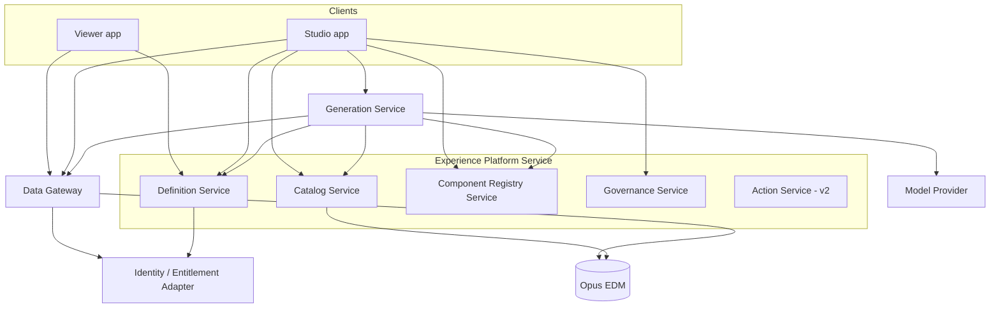

# Backend Architecture

Status: **Draft for approval**
Related: [`architecture-review.md`](./architecture-review.md) · [`security-architecture.md`](./security-architecture.md) · [`ai-architecture.md`](./ai-architecture.md)

---

## 1. What the Backend Is Responsible For

The backend has four jobs, in descending order of architectural consequence:

1. **Be the only path to EDM data**, enforcing entitlements on every request. If this is not true, nothing else in the security architecture holds.
2. **Own the definition lifecycle** — authoring, versioning, immutability, review, promotion, audit.
3. **Own the semantic catalog** — the governed business vocabulary that both authors and the AI bind against.
4. **Host AI orchestration**, because it requires credentials, tenancy, rate limiting, cost attribution and audit that cannot live in a browser.

Everything else is supporting infrastructure.

---

## 2. Service Decomposition

### 2.1 Start as a modular monolith with enforced module boundaries

**Recommendation: build one deployable service with hard internal module boundaries, and extract services only when a specific pressure justifies it.**

This is a deliberate choice against starting with microservices. At this stage the team does not yet know the true transaction boundaries — for example, whether governance state transitions belong in the same transaction as definition version writes. Getting that wrong across a network boundary is far more expensive than getting it wrong across a module boundary. Modules communicate through explicit internal interfaces with no shared database tables between them, so extraction is a deployment change rather than a redesign.

**Two exceptions extract on day one**, for reasons that are architectural rather than organizational:

- **Data Gateway** — different scaling profile (query-bound, bursty), different security posture (holds EDM credentials), and it must be independently auditable and independently hardenable. It is the highest-value target in the system and should have the smallest possible surface.
- **Generation Service** — different scaling profile (long-running, model-provider-bound), different failure modes (provider outages, rate limits), and it must be able to be disabled entirely without taking down the platform. A model provider incident must degrade authoring, not break rendering.

### 2.2 Modules



| Module | Owns | Key responsibility |
|---|---|---|
| **Definition Service** | Experiences, versions, patches, templates | CRUD, immutable versioning, patch application, optimistic concurrency, validation, impact analysis |
| **Catalog Service** | Semantic catalog | Entity/attribute/measure/relationship model, synonyms, sensitivity classification, logical data sources, versioned publication, EDM drift detection, entitlement-scoped retrieval |
| **Component Registry Service** | Component manifests | Publication of manifest sets as versioned registries; version resolution; deprecation impact queries |
| **Governance Service** | Lifecycle and audit | State machine transitions, approvals, separation of duties, environment promotion, append-only audit |
| **Data Gateway** | Query execution | Logical→physical resolution, query planning, **entitlement enforcement**, fan-out and cost limits, caching, query audit |
| **Generation Service** | AI orchestration | Prompt processing, retrieval, context assembly, constrained generation, validation cascade, provenance |
| **Identity / Entitlement Adapter** | Identity integration | Token validation, tenant resolution, platform role resolution, EDM entitlement resolution and caching |
| **Action Service** (v2) | Write-back | Overrides, corrections, bulk actions, idempotency, action audit |

### 2.3 Why the Data Gateway is separate from the Definition Service

A recurring temptation will be to let the Definition Service execute queries during preview, "just for convenience." It must not. One executor means one enforcement point means one place to audit and test. The moment there are two, entitlement behaviour can differ between preview and production — and the difference will be discovered by a client, not by a test.

---

## 3. API Design

### 3.1 Style, chosen per surface

| Surface | Style | Rationale |
|---|---|---|
| Definitions, catalog, templates, registry, governance | REST + JSON | Resource-shaped, cacheable, versionable, straightforward to authorize per resource |
| Data retrieval | POST of a **declarative query request** | Must be enumerable and cost-boundable (§3.3) |
| Generation | REST + SSE | Long-running with meaningful intermediate progress |
| Events | Internal message bus | Cache invalidation, reindexing, audit fan-out |

**GraphQL is rejected for the data surface.** Its value is letting clients shape arbitrary traversals — precisely what this platform must not permit. Arbitrary client-shaped queries make row/column entitlement enforcement and cost bounding substantially harder, and the flexibility buys nothing here: the client is a renderer executing data sources that the platform authored and validated. A closed, declarative query request is both safer and simpler to reason about.

### 3.2 Definition and catalog endpoints

```
GET    /v1/experiences?workspace&state&component=            # incl. impact search
POST   /v1/experiences
GET    /v1/experiences/{id}
GET    /v1/experiences/{id}/versions
GET    /v1/experiences/{id}/versions/{version}
POST   /v1/experiences/{id}/draft/patch                      # JSON Patch, If-Match required
POST   /v1/experiences/{id}/draft/validate
GET    /v1/experiences/{id}/versions/{a}/diff/{b}
POST   /v1/experiences/{id}/lifecycle                        # submit | approve | reject | publish | deprecate
POST   /v1/experiences/{id}/promote                          # target environment
GET    /v1/published/{environment}/{experienceId}/{pageId}   # runtime read, immutable, cacheable

GET    /v1/catalog/versions
GET    /v1/catalog/{catalogVersion}/entities
GET    /v1/catalog/{catalogVersion}/entities/{id}
POST   /v1/catalog/{catalogVersion}/retrieve                 # hybrid search, entitlement-scoped
GET    /v1/registry/versions/{registryVersion}/manifests
```

Design points worth calling out:

- **Patch, not put.** Draft mutation is `POST .../patch` with a JSON Patch body and mandatory `If-Match`. This mirrors the frontend definition store, gives the server the same diff the client applied, makes the AI's output and a human's drag operation the same kind of request, and provides genuine optimistic concurrency for the case where an author and a generation call race.
- **Runtime reads are a separate, narrow endpoint.** `/v1/published/...` returns an immutable definition version for a specific environment. It carries no draft data, no authoring metadata, and is cacheable with a long TTL because the resource can never change. The Viewer needs nothing else from the Definition Service.
- **Validation is an endpoint, not just an internal step.** Studio calls it continuously while editing, and the AI repair loop calls it between attempts. Same code, same results, one implementation.
- **Impact analysis is a first-class query.** `?component=analytics.kpi-card@2` answers "what breaks if we deprecate this," which is the question that makes component evolution safe. It requires indexing into definition JSON (§4.2).

### 3.3 The data surface

```
POST /v1/data/batch
{
  "context":  { "experienceId": "...", "pageId": "...", "definitionVersion": 14 },
  "queries": [
    { "key": "kpi-late-files", "dataSourceId": "ds.fileProcessingToday",
      "params": { "asOf": "2026-08-04", "assetClass": "EQ" },
      "shape":  { "measures": ["lateFileCount"], "dimensions": [], "limit": 1 } },
    { "key": "grid-exceptions", "dataSourceId": "ds.dqExceptions",
      "params": { "severity": ["HIGH"] },
      "shape":  { "attributes": ["securityId","ruleName","severity"],
                  "sort": [{"field":"detectedAt","dir":"desc"}],
                  "page": { "offset": 0, "limit": 50 } } }
  ]
}
```

**One batch endpoint per page render is the central performance decision.** A twelve-widget dashboard issuing twelve independent requests produces twelve auth resolutions, twelve entitlement lookups, twelve audit events, twelve connection acquisitions, and head-of-line blocking on browser connection limits. Batching gives server-side parallelism with a fan-out cap, one entitlement resolution reused across queries, one correlation id for the whole render, shared cache lookup, and a single place to enforce the page-level cost budget.

Per-query responses are independent: each returns `ok`, `denied`, `empty`, `partial` or `error` with a machine-readable reason. A denied column does not fail the batch — it degrades one widget to its `denied` state. This is what makes the frontend's six-state model work end to end.

Additional requirements on this surface:

- Every response carries a server-determined **TTL** and an **entitlement scope hash**. The client uses both for cache keying; it never invents either.
- **Cost guards** evaluated pre-execution: estimated rows scanned, projected fan-out, query timeout. Rejection returns a typed error the Studio can explain to an author *at design time*, before publication.
- A separate `POST /v1/data/estimate` used by the validation cascade so the AI can be told a dashboard is too expensive before a user ever sees it.

### 3.4 Cross-cutting API conventions

| Concern | Convention |
|---|---|
| Errors | RFC 9457 `application/problem+json` with a stable taxonomy: `validation`, `semantic`, `entitlement`, `cost`, `concurrency`, `upstream`, `provider` |
| Concurrency | `ETag` / `If-Match` on all definition mutations |
| Idempotency | `Idempotency-Key` required on all non-GET data-affecting endpoints |
| Versioning | `/v1` path for the API; `schemaVersion` inside payloads for artifacts; the two version independently |
| Contracts | OpenAPI + JSON Schema published as one package, codegen'd to the frontend `contracts` library |
| Tracing | W3C trace context propagated prompt → definition → query → render |
| Pagination | Cursor-based for collections; offset/limit only inside `data` shapes where grids require it |

The error taxonomy is load-bearing rather than cosmetic: the Studio UX branches on it to decide what to tell an author, and the AI repair loop branches on it to decide whether to retry, re-retrieve, or fall back. Free-text error messages would make both impossible.

---

## 4. Storage Model

### 4.1 Choice of store

**Recommendation: PostgreSQL as the primary store, using relational structure for identity and lifecycle and `JSONB` for definition bodies.** Plus Redis for caching and pgvector for catalog semantic retrieval.

The instinct to use a document database for JSON definitions should be resisted, for three specific reasons:

1. **Lifecycle transitions need transactions.** Publishing means: create an immutable version row, transition state, write bindings for the target environment, and write an audit record. Atomic or not at all.
2. **Definitions have referential integrity.** A version pins a catalog version and a registry version. Those references must be enforceable.
3. **We must query inside definitions.** Deprecating a component requires finding every definition that references it. GIN-indexed `JSONB` answers this; a schemaless document store makes it a full scan.

`JSONB` provides the schema flexibility that motivates document stores, without giving up any of the three properties above.

### 4.2 Definition storage

```
experience
  id, tenant_id, workspace_id, name, description, kind,          -- dashboard | search | detail | app
  owner_id, current_draft_version, lifecycle_state,
  created_at, updated_at
  UNIQUE (tenant_id, workspace_id, name)

experience_version                                               -- APPEND ONLY
  experience_id, version, definition JSONB,
  schema_version, catalog_version, registry_version,
  provenance JSONB,                                              -- prompt, model, exemplars, cost
  author_id, created_at, state, immutable BOOLEAN
  PRIMARY KEY (experience_id, version)
  GIN index on definition
  GIN index on (definition -> 'components' -> 'type')            -- impact analysis

experience_patch                                                 -- APPEND ONLY
  experience_id, seq, base_version, patch JSONB,
  origin,                                                        -- user | ai | migration
  actor_id, created_at

experience_publication
  experience_id, environment, published_version,
  published_by, published_at, approved_by, approval_ref
  UNIQUE (experience_id, environment)

experience_binding                                               -- environment resolution
  tenant_id, environment, logical_data_source_id,
  physical_target JSONB, updated_by, updated_at

template
  id, tenant_id | NULL,                                          -- NULL = platform-curated
  definition_version_ref, category, tags,
  curated BOOLEAN, exemplar_eligible BOOLEAN, embedding VECTOR
```

Four invariants enforced in the database, not only in application code:

- **`experience_version` rows are never updated once `state = published`.** Enforced by trigger and by the absence of `UPDATE` grants on published rows. Immutability is a storage property; if it lives only in service code, one code path eventually violates it.
- **`experience_patch` is append-only**, giving replay, audit and undo from the same log the frontend maintains.
- **`tenant_id` is present on every row** and covered by row-level security (§5).
- **`experience_binding` is the only place physical data targets appear.** Definitions reference logical data source ids exclusively. This is what makes Dev→UAT→Prod promotion a rebinding operation rather than a content edit, which in turn keeps the audit chain intact. It is a storage decision that exists to satisfy a governance requirement.

`exemplar_eligible` on templates deserves note: it marks a template as usable as an AI few-shot example. Because exemplars can cross tenant boundaries only when platform-curated, this flag is a security control as well as a quality control (see [`security-architecture.md`](./security-architecture.md) §7).

### 4.3 Catalog storage

```
catalog_version         id, tenant_id, version, state, published_at, published_by
catalog_entity          catalog_version_id, id, business_name, synonyms[], description,
                        logical_data_source_id, sensitivity, embedding VECTOR
catalog_attribute       entity_id, id, business_name, synonyms[], data_type, unit, currency,
                        format, sensitivity, filterable, groupable, effective_dating,
                        physical_ref, embedding VECTOR
catalog_measure         entity_id, id, business_name, allowed_aggregations[],
                        default_aggregation, unit, expression, sensitivity, embedding VECTOR
catalog_relationship    from_entity_id, to_entity_id, cardinality, join_semantics, traversal_cost
catalog_data_source     id, entity_id, logical_id, parameters JSONB, cost_class, volatility_ttl
```

- **Versioned by immutable published snapshot.** A definition pins the exact catalog version it was authored against, so a catalog change cannot silently alter the meaning of a live page. Draft catalog versions are mutable; published ones are not.
- **Embeddings colocated with the rows they describe**, so semantic retrieval and entitlement filtering happen in one query rather than retrieve-then-filter. That ordering matters for correctness, not just performance — see [`ai-architecture.md`](./ai-architecture.md) §3.
- **`volatility_ttl` on data sources** is why the gateway, not the client, decides cache TTL: volatility is a property of the data, known to the steward.
- **Drift detection** compares `physical_ref` values against live EDM metadata on a schedule and raises steward tasks. Without it the catalog silently rots and the AI's grounding degrades invisibly — the most insidious failure mode in this architecture.

### 4.4 Audit storage

Separate schema, separate credentials, append-only, tenant-partitioned, long retention, no `UPDATE` or `DELETE` grants to any application role.

Recorded: authentication and authorization decisions; every definition lifecycle transition with actor and approval reference; every data query with correlation id, data sources, resolved entitlement scope, row counts and duration; every generation event with full provenance; every administrative action on catalog, registry, bindings and roles; every export.

Audit is separated because its retention, access control and immutability requirements differ from operational data, and because an auditor role must be able to read it without any access to the data plane.

### 4.5 Caching

| Cache | Key | TTL | Notes |
|---|---|---|---|
| Published definition | `experienceId:version:environment` | Long | Immutable resource; safe to cache at edge |
| Compiled catalog retrieval pack | `catalogVersion:queryHash:entitlementScope` | Medium | Feeds generation |
| Query results | `dataSourceId:paramsHash:entitlementScopeHash` | Per-source `volatility_ttl` | **Entitlement scope in the key is mandatory** |
| Entitlement resolution | `userId:tenantId` | Short | Must be short; entitlement revocation has to take effect quickly |
| Component registry | `registryVersion` | Long | Immutable |

The entitlement scope hash in the query key is the single most consequential line in this table. Omitting it produces cross-user data leakage through the cache — an authorization bypass that no amount of correct enforcement code prevents. It is repeated in the security document for that reason.

---

## 5. Multi-Tenancy at the Storage Layer

Two tiers, chosen per client rather than platform-wide:

| Tier | Mechanism | For |
|---|---|---|
| **Shared schema** (default) | `tenant_id` on every row + PostgreSQL row-level security policies bound to the session's tenant claim | Most clients |
| **Isolated database** | Separate database or cluster per tenant | Clients with contractual or regulatory isolation requirements |

Row-level security is defense in depth, not the primary control — application queries always filter by tenant. RLS exists because it converts a forgotten `WHERE` clause from a cross-tenant data breach into an empty result set. Given the consequence, the redundancy is warranted.

Region-pinned deployment supports data residency, and the pinning must include the model provider region ([`security-architecture.md`](./security-architecture.md) §7).

---

## 6. Reliability and Operations

**Degradation must be graded, and the grading is a product decision as much as a technical one:**

| Failure | Required behaviour |
|---|---|
| Model provider unavailable | Authoring continues without AI; hand-authoring and templates unaffected; rendering unaffected |
| Generation Service down | Same as above; Studio hides AI affordances with an explanation |
| EDM slow or unavailable | Page shell renders; widgets show `error` with retry; cached results served where TTL permits |
| Catalog Service down | Published pages render (they pin a catalog version); new authoring is blocked |
| Definition Service down | Published pages continue to render from cache; authoring is blocked |
| Data Gateway down | Nothing data-bound renders — no fallback, by design. There is no second path to EDM |

The last row is the intended consequence of single-enforcement-point: the gateway is a single point of failure precisely because it is the single point of control. It therefore requires the highest availability target, horizontal scaling, and independent load-shedding — but never a bypass.

Supporting practices: OpenTelemetry traces spanning prompt → definition → query → render; the transactional outbox pattern for domain events (publication, catalog release, registry release) so cache invalidation and reindexing cannot be lost; per-tenant rate limits and cost budgets on both the data and generation surfaces; blue/green deployment with definition schema migrations applied forward-compatibly so the previous service version can still read new rows.

---

## 7. Decisions Requiring Ratification

| # | Decision | Consequence if reversed later |
|---|---|---|
| B1 | Modular monolith, with Gateway and Generation extracted from day one | Either premature distribution cost or a painful later split of transaction boundaries |
| B2 | Data Gateway is the sole path to EDM | Entitlement enforcement becomes unverifiable |
| B3 | Declarative batch query API; GraphQL rejected for data | Cost bounding and entitlement enforcement become materially harder |
| B4 | PostgreSQL + JSONB; not a document store | Loss of transactional lifecycle and impact analysis |
| B5 | Append-only, immutable published versions enforced in the database | Audit and rollback guarantees weaken to best-effort |
| B6 | Logical data sources with per-environment binding | Promotion requires content edits, breaking the audit chain |
| B7 | Catalog versioned by immutable snapshot and pinned by definitions | Live pages change meaning when the catalog changes |
| B8 | Entitlement scope in every cache key | Cross-user data leakage via cache |
| B9 | Patch-based definition mutation with `If-Match` | Lost updates between authors and AI; no server-side diff for audit |
| B10 | Stable machine-readable error taxonomy | Studio UX and AI repair loop lose the ability to branch on cause |
