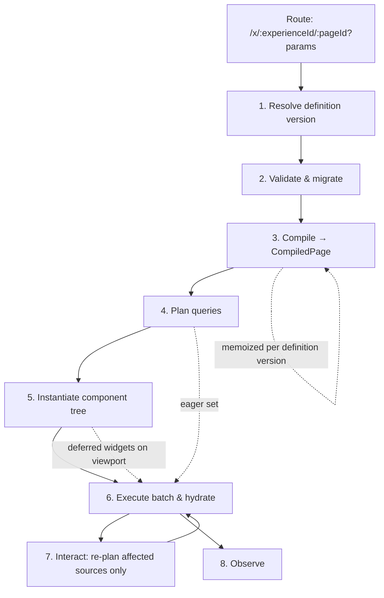

# Runtime Architecture

Status: **Draft for approval**
Related: [`frontend-architecture.md`](./frontend-architecture.md) · [`backend-architecture.md`](./backend-architecture.md) · [`security-architecture.md`](./security-architecture.md)

This document answers one question in detail: **how does a JSON page definition become a running, governed, entitled application?**

**Implemented in M1.** Stages 1–8 below run in `libs/renderer`, with a mock gateway standing in for stage 3's data plane. Every claim in §1, §5, §6, §8, §9 and §10 was verified in a browser — see [`../docs/M1-IMPLEMENTATION.md`](../docs/M1-IMPLEMENTATION.md) §2.

---

## 1. The Runtime Guarantee

Everything below serves a single guarantee, and it is worth stating before the mechanism:

> **A published definition, rendered for a given user against given data, produces the same page every time. No model participates in rendering.**

Determinism is what makes the platform enterprise-viable. It means a published dashboard can be tested, supported, screenshotted for a regulator, and reasoned about. It means a model provider outage cannot affect a business user. It means a bug is reproducible from three inputs: definition version, user entitlements, data.

The AI's role ends when a definition is published ([`ai-architecture.md`](./ai-architecture.md) §1.1). The runtime is a deterministic interpreter.

A second guarantee follows from it: **one code path, three surfaces.** Published rendering, Studio preview, and template thumbnails all execute the same pipeline. They differ only in which version is loaded and whose entitlements apply. A separate preview path is the standard origin of "it worked in preview" defects, and this architecture does not have one.

---

## 2. Pipeline Overview



Stages 1–3 happen once per definition version. Stage 4–6 happen once per page view. Stage 7 is the steady state, and it is where the design earns its keep: a filter change must not repeat stages 1–5.

---

## 3. Stage 1 — Resolve

```
GET /v1/published/{environment}/{experienceId}/{pageId}
```

The Viewer requests a **published** definition for a specific environment. The response is an immutable version.

| Property | Consequence |
|---|---|
| Immutable per version | Cacheable indefinitely; safe at CDN/edge with a version-scoped key |
| Environment-scoped | The definition is environment-agnostic; only its *binding resolution* differs (§9) |
| Authorization-checked | Access to the experience is a platform permission decision, distinct from data entitlement |

Two failure paths must be handled here rather than deeper: the experience has no published version for this environment (show a clear "not published here" state, not a 404 shell), and the user lacks permission to view it (a `denied` page state — never a blank screen).

Note what the runtime does **not** receive: draft content, authoring metadata, physical data targets, or the security intent block as an enforcement input. The definition is intent; enforcement happens in the gateway.

---

## 4. Stage 2 — Validate and Migrate

The definition carries `schemaVersion`. Stored definitions outlive schema revisions, so the runtime must handle older versions.

**Recommendation: lazy forward migration in memory.**

- Migrations are pure, ordered, chained functions: `v1→v2→v3`. Each is small, tested, and reversible in intent if not in code.
- Migration happens at load, **in memory only** — the stored definition is never mutated as a side effect of someone viewing a page. Mutating stored artifacts during a read would violate publication immutability and would make an audit record change without an actor.
- An optional background job may rewrite old versions to current schema as an explicit, audited maintenance action.
- Migration failure is a hard, loud failure with telemetry naming the definition and version. It must never render a partially-migrated page.

Runtime validation is lighter than authoring validation — published definitions passed the full cascade before publication. It checks schema conformance and version compatibility, and treats anything else as a defect worth reporting rather than repairing.

---

## 5. Stage 3 — Compile

Compilation transforms a definition into an immutable **`CompiledPage`** plan. It is the most important performance decision in the runtime: it separates work that depends only on the definition from work that depends on the view.

| Compilation output | Built from |
|---|---|
| Layout tree with breakpoint variants | `layout` + per-breakpoint overrides |
| Component resolutions | Registry lookup per `type` → lazy import handle |
| Compiled expressions | Expression source → pure function factories |
| Query descriptors | `dataSources` → parameterized descriptors |
| Dependency graph | Which data sources depend on which params, filter channels and selections |
| Interaction wiring | Declared action → target mapping |

**`CompiledPage` is memoized by definition version.** Because published versions are immutable, this cache can never be stale. Navigating away and back, switching breakpoints, or re-rendering after a filter change costs nothing in compilation.

**The dependency graph is the payoff.** Derived statically from expression and parameter references, it tells the runtime exactly which data sources a given filter change invalidates. Without it, the only safe behaviour on any state change is to re-query everything — which is what makes many low-code dashboards feel slow. With it, changing an asset-class filter re-queries the three widgets that use it and leaves the other nine untouched.

Unknown component types are resolved here, and the handling is deliberate (§10): a placeholder, not a failure.

---

## 6. Stage 4 — Plan Queries

The planner turns query descriptors into an execution plan for this specific view.

1. **Resolve parameters** from URL params, defaults, filter channel state, and user context.
2. **Partition into eager and deferred sets.** Above-the-fold widgets are eager. Below-the-fold widgets defer until their container enters the viewport.
3. **Batch the eager set** into a single `POST /v1/data/batch`.
4. **Consult the query cache** first, keyed by `(dataSourceId, paramsHash, entitlementScopeHash)`. Cache hits are removed from the batch.
5. **Apply the page cost budget.** If the plan exceeds the fan-out limit, the excess is deferred rather than dropped, and telemetry records it. Silent truncation would make a page appear complete when it is not.

The single-batch decision is justified in [`backend-architecture.md`](./backend-architecture.md) §3.3. Its runtime consequence: one round trip, one entitlement resolution, one audit correlation id for the entire page render.

---

## 7. Stage 5 — Instantiate

The renderer walks the compiled layout tree and builds the live component tree.

- **Host containers** are created per layout node from the breakpoint-appropriate variant.
- **Components are created dynamically** from the registry's lazy imports, with inputs bound as signals so later data arrival updates the component rather than recreating it.
- **Deferred widgets** are wrapped so their component bundle *and* their query both trigger on viewport intersection. Skeleton dimensions come from the manifest, so deferred regions do not cause layout shift.
- **Every widget is wrapped in an error boundary** (see [`frontend-architecture.md`](./frontend-architecture.md) §5.5). Failure in construction, binding evaluation, or component code degrades that one widget.

The error boundary is not defensive programming; it is a product requirement. Definitions are authored by business users and generated by a model, so a malformed widget is an expected condition. One bad widget blanking a twelve-widget dashboard would make the platform feel fragile in exactly the situation it must feel robust.

---

## 8. Stage 6 — Hydrate

The batch response returns per-query results, each independently statused. Results route to widgets by data source key, and each widget transitions its state shell independently:

| Per-query outcome | Widget state |
|---|---|
| `ok` with rows | `ready` |
| `ok` with zero rows | `empty` |
| `partial` (truncated, or some columns denied) | `partial` — renders what is permitted, indicates what is not |
| `denied` (row or column entitlement) | `denied` — "not available to you", explicitly not an error |
| `error` (upstream, timeout) | `error` with retry |
| `cost_rejected` | `error` with an explanation the author can act on |

Independent statusing is what makes a mixed-entitlement page work correctly. Two users open the same published dashboard: one sees twelve widgets, the other sees nine plus three `denied`. Both are correct renderings of the same definition. This is normal operation for a governed platform, not degradation — which is why `denied` is a distinct state rather than an error variant.

---

## 9. Stage 7 — Interact

The steady state. Four interaction classes, all declared in the definition and all handled without re-entering earlier stages:

| Interaction | Mechanism |
|---|---|
| **Filter change** | Write to a `PageContext` filter channel → dependency graph identifies affected data sources → those re-query in one batch → unaffected widgets untouched |
| **Selection** | Row/point selection writes to a selection channel; widgets declaring a dependency react |
| **Drill-down** | Declared action resolves to a target experience/page plus parameter mapping → navigation with URL params → new page render |
| **Cross-page parameters** | Params are URL-synced, so every state is deep-linkable, shareable and bookmarkable |

Two properties matter here. Interaction is **declarative**, so the AI can generate it — interactivity expressed in hand-written component code would be permanently outside the model's reach. And it is **statically analysed**, so the runtime knows the invalidation set without executing anything.

Deep-linkability via URL-synced params is a small decision with large operational value: it is how an analyst sends a colleague the exact filtered view of an exception queue they are discussing.

---

## 10. Failure Modes

Every failure has a defined, non-blank behaviour. The table is the specification.

| Failure | Behaviour | Rationale |
|---|---|---|
| Experience not published in this environment | Clear "not available in this environment" page | Distinguishable from a bug |
| Not permitted to view experience | `denied` page state | Never leak existence via error detail |
| `schemaVersion` newer than runtime | Hard fail with version telemetry | Rendering a partially-understood definition is worse than failing |
| Migration error | Hard fail, alert, definition and version named | Silent partial migration corrupts meaning |
| **Unknown component type** | Placeholder widget in the slot; rest of page renders; telemetry | Registry/definition version skew must degrade, never blank a page |
| Component bundle fails to load | Widget `error` with retry | Network fault, not a content fault |
| Expression evaluation error | Widget `error`; expression and widget id in telemetry | Isolated to the widget that depends on it |
| Data source denied | Widget `denied` | Expected governance outcome |
| Query timeout | Widget `error` with retry; page shell intact | Partial dashboards remain useful |
| Query cost rejected | Widget `error` with author-actionable explanation | Turns a runtime problem into a design-time fix |
| Gateway unavailable | All data widgets `error`; shell, navigation, layout render | No second path to EDM exists, by design |
| Stale cache after publication | Publication event invalidates definition caches via the outbox | New version must take effect promptly |

The three rows in bold-adjacent significance — unknown component, denied source, gateway down — are the ones that separate a demo from a platform. Each is a *normal* occurrence in a multi-tenant, multi-version, entitlement-governed system.

---

## 11. Caching Layers

| Layer | Location | Key | Invalidation |
|---|---|---|---|
| Published definition | CDN + client | `experienceId:pageId:version:environment` | Never (immutable); new version = new key |
| `CompiledPage` | Client memory | Definition version | LRU eviction |
| Component bundles | CDN + browser | Content hash | Never |
| Query results | Redis (server) + client memory | `dataSourceId:paramsHash:entitlementScopeHash` | `volatility_ttl` from gateway; write-action invalidation |
| Catalog metadata for authoring | Server | `catalogVersion` | Never (immutable snapshot) |

The immutability of published versions is what makes the top of this table trivially safe — most cache-invalidation complexity in comparable systems comes from mutable published artifacts. Paying for immutability in the storage model ([`backend-architecture.md`](./backend-architecture.md) §4.2) buys correctness here.

The entitlement scope hash in the query key is restated deliberately: it is the one entry in this table whose omission is a security defect rather than a performance problem.

---

## 12. Environment Promotion at Runtime

The runtime is environment-agnostic, and this is the mechanism that makes governance-clean promotion possible.

```
Definition          "dataSourceId": "ds.dqExceptions"        ← logical, immutable
                                    │
Gateway resolves    experience_binding[tenant, environment]  ← physical target
                                    │
EDM                 UAT cluster / Prod cluster / …
```

A definition published to UAT and promoted to Prod is **byte-identical**. Only the binding row differs. Consequences:

- Promotion is an approval plus a pointer change, not a content edit — so the audit chain from generation through review to production is unbroken.
- The version a reviewer approved is provably the version running in production.
- Rollback is a pointer change back to a prior immutable version, with no content reconstruction.

This is the concrete payoff of decision B6 in the backend document, and the reason logical data sources had to be in the definition schema from v0.1 rather than added later.

---

## 13. Observability

Emitted per page render, tagged with `definitionVersion`, `registryVersion`, `catalogVersion`, `tenantId`, `environment` and a `correlationId` shared with the server-side query audit:

| Category | Signals |
|---|---|
| Render | Time to first meaningful render; per-widget time-to-ready; count of widgets over budget; layout shift |
| Data | Queries per render; batch latency; per-query latency; cache hit rate; rows returned; truncations |
| Failure | Widget error rate by component type and version; unknown-type placeholders; denied counts; timeouts |
| Governance | Denied-widget counts per experience — a high rate signals a page authored against entitlements its audience lacks |
| Usage | Which widgets are viewed, which filters are used, which drill-downs are followed |

Two of these are product instruments rather than operational ones. **Denied-widget rate** tells stewards that an experience is mis-targeted for its audience. **Usage telemetry** tells the team which generated components are actually valuable, which feeds both component library priorities and the AI's layout heuristics — the runtime observing itself well enough to improve the generator.

Full-trace continuity matters: a single correlation id should link the prompt that generated a definition, the version published, the queries a render issued, and the audit rows they produced.

---

## 14. Decisions Requiring Ratification

| # | Decision | Consequence if reversed later |
|---|---|---|
| R1 | No model call in the render path | Loss of determinism, testability, and outage independence |
| R2 | One renderer for published, preview and thumbnails | Preview/production divergence defects |
| R3 | Compile once per definition version, memoized | Recompilation on every interaction |
| R4 | Statically derived dependency graph for invalidation | Every state change re-queries the whole page |
| R5 | Lazy in-memory forward migration; stored definitions never mutated on read | Publication immutability and audit integrity break |
| R6 | Per-widget error boundaries | Single widget failures blank whole pages |
| R7 | Independent per-query statusing with a distinct `denied` state | Mixed-entitlement pages cannot render correctly |
| R8 | Eager/deferred partition with a single eager batch | Fan-out and first-render budgets are unachievable |
| R9 | Unknown component types degrade to placeholders | Version skew becomes an outage |
| R10 | Logical data sources resolved per environment at the gateway | Promotion requires content edits |
