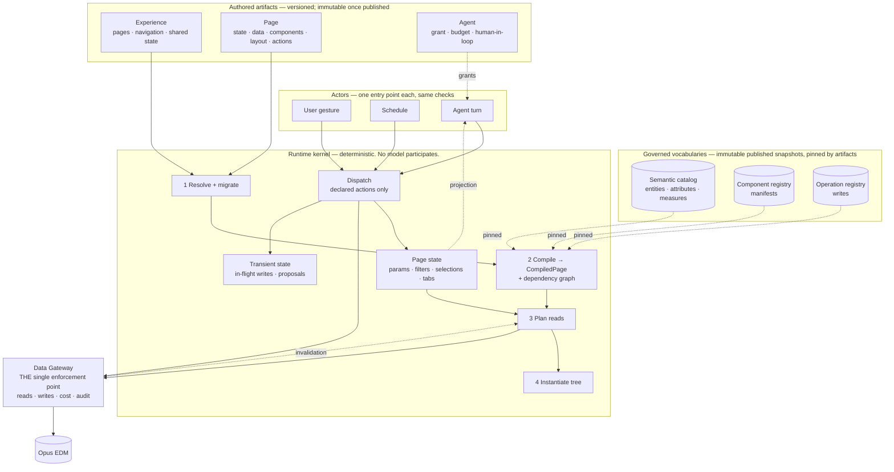

# Core Runtime Specification

Status: **Draft for approval. No implementation until approved.**
Scope: the runtime *model* — what the things are, how they relate, what may change them.
Companion: [`../runtime-architecture.md`](../runtime-architecture.md) specifies the render *pipeline*; this set specifies the *kernel the pipeline executes*, and extends it with the write path, the actor model, and the compatibility contract.

---

## 1. What This Specification Is For

Opus Experience Studio must host four classes of application over governed EDM data:

| Class | Example |
|---|---|
| **Dashboards** | Security master operations: scope, backlog, disagreement, breaks |
| **Search experiences** | Find an instrument across 40 million rows without scanning them |
| **Workflow applications** | Work the exception queue: assign, annotate, waive, close |
| **AI agents** | An assistant that triages that queue and acts within a granted reach |

The first two are built. The third is reserved in the schemas and rejected by the validator. The fourth does not exist in the model at all.

The requirement driving this document is that **all four must be the same runtime**. Not four runtimes behind one shell, and not one runtime with three special cases — because a platform whose fourth application class needs a fourth execution path cannot absorb a fifth. Two thousand stored definitions will exist by then, each pinned to a contract, and the cost of the change lands on all of them at once.

So the question this specification answers is narrower and harder than "how does a page render":

> **What is the smallest set of runtime concepts that expresses dashboards, search, workflow and agents — such that adding the later ones is a new artifact type and a new actor kind, and not a new code path?**

The answer is seven concepts and seven laws. Everything else in these documents is consequence.

---

## 2. The Kernel

Read the diagram for what is *absent*: no model in the kernel, no second path to EDM, no actor with a private entry point, and no arrow from a component to anything. Those absences are the design.

---

## 3. The Seven Answers

Each is developed in its own document. Stated here in one line, because a definition that cannot survive one line is not yet a definition.

| # | Question | Answer | Detail |
|---|---|---|---|
| 1 | **What is an Experience?** | A versioned, navigable **application boundary**: a set of pages, the state they share, the graph they drill through, and the governance envelope they are published under. It is the unit of publication, promotion, entitlement-to-view and parameter persistence. | [`02-experience.md`](./02-experience.md) |
| 2 | **What is a Page?** | A **declared pure function** `(definition, state, data, identity) → view`, expressed as six declarations: state contract, data contract, vocabulary in use, structure, behaviour, governance. `kind` is a heuristic label, never a runtime branch. | [`03-page.md`](./03-page.md) |
| 3 | **What is a Component?** | A **context-free presentation function** `(config, data, context, slots) → view + action events`, whose contract is a machine-readable manifest with five consumers. It never fetches, never navigates, never writes state. | [`04-component.md`](./04-component.md) |
| 4 | **What is a Data Source?** | A **declarative logical question** about the catalog, resolved to a physical target and an entitled answer by the gateway alone. Its mirror image is an **Operation**: a declarative logical *change*, through the same enforcement point, with the same versioned-vocabulary discipline. | [`05-data-and-operations.md`](./05-data-and-operations.md) |
| 5 | **How are pages rendered?** | Resolve → migrate → compile → plan → instantiate → hydrate, then a steady state of two loops: the **read loop** (state change → dependency graph → targeted re-query) and the **write loop** (dispatch → confirm → operation → authoritative invalidation → re-query). | [`06-rendering.md`](./06-rendering.md) |
| 6 | **How are AI-generated pages represented?** | **Identically to hand-authored ones**, plus a `provenance` block. That is the whole answer, and it is deliberate: generation is design-time, so a generated page has no runtime representation of its own. Runtime AI arrives as an **actor**, not as a renderer. | [`07-ai-and-agents.md`](./07-ai-and-agents.md) |
| 7 | **How do pages evolve without breaking?** | Four independent version axes, immutable published versions, lazy in-memory forward migration, additive-only vocabularies, and one **degradation contract** covering every unknown vocabulary member — not just unknown components. | [`08-evolution.md`](./08-evolution.md) |

The object model behind all seven — class diagrams, state machines, the five state tiers — is [`01-object-model.md`](./01-object-model.md).

---

## 4. The Seven Laws

These are the kernel's invariants. Each is testable, each has a named consequence if it is broken, and each is the reason some later addition is cheap.

| # | Law | Consequence if violated |
|---|---|---|
| **L1** | **No model participates in rendering.** A render is reproducible from definition version, identity and data. | A dashboard cannot be tested, screenshotted for a regulator, or served during a provider outage. |
| **L2** | **A definition is intent; the gateway decides.** Authored artifacts are untrusted with respect to entitlements, and so is the model that writes them. | Definition tampering becomes a data-access path. |
| **L3** | **Components are pure; the page owns meaning.** A component reports that something happened; the page's declared actions decide what it means. | Interaction leaves JSON, so it leaves the AI's reach and the validator's reach at the same moment. |
| **L4** | **Every state change is a declared transition.** Nothing mutates page state except a declared action, dispatched through one dispatcher. | The dependency graph stops being derivable, so every change re-queries everything. |
| **L5** | **Every data change is a registry operation** with idempotency, concurrency, declared effects and audit — never an ad-hoc call. | Write-back becomes a second data path with its own authorization and its own audit gaps. |
| **L6** | **Every actor uses the same entry points** and is subject to the same checks. A user, a schedule and an agent differ in *reach*, never in *mechanism*. | Agents need a privileged path, and the privileged path is where the breach happens. |
| **L7** | **Unknown vocabulary degrades visibly.** An unrecognised container, action kind, component or operation renders as a stated placeholder and reports itself; it never blanks a page and is never silently dropped. | Version skew becomes an outage, or worse, a page that quietly does less than it claims. |

L1–L4 are already true of the implemented runtime. L5, L6 and L7 are what this specification adds — and L5 and L6 are the two whose retrofit cost is highest, because they touch every audit consumer and every call site.

---

## 5. Closure: Four Application Classes, One Runtime

The test of this design is whether the four classes are expressible without new kernel concepts. Each row names what the class needs and what, if anything, must be added.

| Class | Expressed by | Needs adding | Kernel change |
|---|---|---|---|
| **Dashboard** | `kind: dashboard`, aggregate sources, eager load policy, KPI/chart/table components, `setFilter` / `drilldown` actions | — | **None.** Built. |
| **Search** | `kind: search`, `dataSource.kind: search` with `loadPolicy: onDemand`, entity `cost.requiresFilter`, an `input` component, `setFilter` actions | `onDemand` must actually defer until input exists (today it behaves as `deferred`) | **None.** A planner rule, not a concept. |
| **Workflow application** | `kind: workspace`, a task or queue entity in the catalog, `selection` channels for the working set, `invoke` actions, `refresh.onActions`, `confirm` with `requiresReason` | **Operation registry** (new artifact type) + the write loop in the dispatcher | **None.** An operation is a data source with the arrow reversed. |
| **AI agent** | An `agent` artifact granting a subset of a page's *already declared* data sources, actions and operations; `ActorContext` on every request; the page-state envelope as the agent's view | **Agent definition** (new artifact type) + **actor context** on requests | **None.** An agent is an actor holding a grant, not a new execution path. |

Two additions, both new artifact types; zero new kernel concepts. That is the claim this specification makes, and §6 is the honest account of what it costs.

The claim also has a **falsifier**, which is worth stating so approval means something: if expressing a workflow application requires the renderer to branch on `page.kind`, or expressing an agent requires a request path the gateway authorizes differently, then this design has failed and should be rejected rather than patched.

---

## 6. What This Specification Adds

Four additions and two corrections. Nothing existing is redefined.

| # | Addition | Why it cannot wait |
|---|---|---|
| **A1** | **Operation registry** — `schemas/operation.schema.json`. The write vocabulary: intent, targeting, parameters, concurrency, idempotency, declared effects, capabilities, agent ceiling, cost class. | `invoke` has been a reserved action kind since v0.1 with nothing to point at. The parts expensive to retrofit are idempotency, concurrency and the declared blast radius — all three change every call site if added later. |
| **A2** | **Actor context** — `runtime-contract.schema.json#/$defs/actorContext`. Who initiated a request: user, schedule, agent, system; and for the non-human kinds, the human principal it acts for. | Every audit consumer is built against the audit row's shape. Adding "which agent, for whom, in which turn, with what stated reason" afterwards means rewriting all of them, and re-auditing the period before the change is impossible. |
| **A3** | **Page-state envelope** — `schemas/page-state.schema.json`. The serializable state of a rendered page. | `syncToUrl` is declared across the page model and unimplemented. Deep links, support reproduction, workspace restore and agent context are four consumers of one artifact that does not exist, so each would invent its own encoding. |
| **A4** | **Runtime capability descriptor** — `runtime-contract.schema.json#/$defs/runtimeCapabilities`. What a runtime version can execute. | It converts version skew from a production discovery into an authoring-time warning, and it is what makes L7 checkable rather than aspirational. |

| # | Correction to existing design | Statement |
|---|---|---|
| **C1** | **`kind` must not branch the runtime.** | It selects layout heuristics, default page actions and generation exemplars at *design* time. If the renderer ever switches on it, the four classes become four runtimes. Today's implementation is correct; nothing states the rule, so nothing prevents its loss. |
| **C2** | **The dependency graph covers writes, and the server is its authority.** | Reads are invalidated by state changes *and* by operations. The operation's declared `effects` are a hint; the operation *response* carries the authoritative invalidation set, and the client honours the union. A declared set treated as complete leaves a stale widget after every write with an unenumerated side effect. |

---

## 7. Known Gaps This Specification Does Not Close

Stated here so approval is not mistaken for completeness.

| Gap | Disposition |
|---|---|
| Workflow *engine* — state machines, SLAs, escalation, compensation | Deliberately out of scope, as it has been since v0.1. This specification models the **seam**: a workflow application is a page over a task entity with operations. The engine is a distinct product surface with its own schema. |
| Agent *reasoning* — planning, tool-call loops, model orchestration | Out of scope. This specification bounds what an agent may reach and how it is audited. How it decides is the Generation Service's concern, and is deliberately not a runtime concept. |
| Multi-user real-time collaboration on one page | Not modelled. The patch log makes it approachable later; nothing here presumes it. |
| Offline and conflict-resolution semantics | Not modelled. Optimistic concurrency covers the single-writer race, not disconnected operation. |
| Streaming / push data sources | Only `interval` refresh is modelled. A push source adds a source kind and a transport decision. |
| Validation levels 5, 6 and 8 | Still server-side and still not run in the browser. §5 of [`08-evolution.md`](./08-evolution.md) states what the capability descriptor must report while that remains true. |

---

## 8. Reading Order

| Order | Document | For |
|---|---|---|
| 1 | [`01-object-model.md`](./01-object-model.md) | The class diagrams and state machines. Read first if you want the shape before the argument. |
| 2 | [`02-experience.md`](./02-experience.md) · [`03-page.md`](./03-page.md) · [`04-component.md`](./04-component.md) | The three authored concepts, outside in. |
| 3 | [`05-data-and-operations.md`](./05-data-and-operations.md) | Reads and writes as one model. The document where workflow support is decided. |
| 4 | [`06-rendering.md`](./06-rendering.md) | Sequence diagrams: cold render, read loop, write loop, failure paths. |
| 5 | [`07-ai-and-agents.md`](./07-ai-and-agents.md) | Generated pages, and agents as actors. |
| 6 | [`08-evolution.md`](./08-evolution.md) | Version axes, migration, the degradation matrix. |

Schemas introduced by this specification: [`../../schemas/operation.schema.json`](../../schemas/operation.schema.json) · [`../../schemas/agent.schema.json`](../../schemas/agent.schema.json) · [`../../schemas/page-state.schema.json`](../../schemas/page-state.schema.json) · [`../../schemas/runtime-contract.schema.json`](../../schemas/runtime-contract.schema.json). All four are additive: no existing schema changes, so every stored definition stays valid. Worked examples are in [`../../schemas/examples/`](../../schemas/examples/) and are gated by `npm run validate`.

---

## 9. Decisions Requiring Ratification

The agenda for runtime sign-off. Each should become an ADR on acceptance.

| # | Decision | Consequence if reversed later |
|---|---|---|
| **RC1** | Seven concepts only: Experience, Page, Component, Data Source, Operation, Action, Actor. Anything else is a composition. | Concept sprawl; every addition needs a new interpreter path. |
| **RC2** | `page.kind` never branches the runtime (C1). | Four application classes become four runtimes; the fifth is a rewrite. |
| **RC3** | Operations are registry artifacts, pinned by version, never inline in a page. | A page can invent a write; a write can change shape under a published page. |
| **RC4** | Reads and writes share one envelope, one enforcement point, one audit path. | Write-back becomes a second data plane with its own entitlement bugs. |
| **RC5** | Declared `effects` are a hint; the operation response is the authority (C2). | Stale widgets after every write with an unenumerated side effect. |
| **RC6** | `ActorContext` on every request, with a human principal required for non-human actors. | Unattributable actions; audit consumers rewritten after agents ship. |
| **RC7** | An agent's reach is the intersection of its grant, the page's declarations, its principal's capabilities and the gateway's entitlements. | An agent becomes a privilege escalation path. |
| **RC8** | An agent may change state or propose a patch; it may never emit markup, a query shape, or a component. | L1 falls, and with it determinism, testability and outage independence. |
| **RC9** | Page state is a defined serializable envelope carrying no rows and no entitlement decisions. | Every surface invents an encoding; a link eventually carries a cached authorization. |
| **RC10** | Five state tiers, never merged — session, definition, page runtime, **transient**, server data. | Transient write state enters the patch log and the saved artifact; server data enters undo history and crosses entitlement scopes. |
| **RC11** | One degradation contract for every unknown vocabulary member (L7), with a published capability descriptor. | Skew is discovered in production, one vocabulary axis at a time. |
| **RC12** | No implementation of A1–A4 before ratification. | The platform acquires a second data path and an actor model by accident rather than by decision. |
