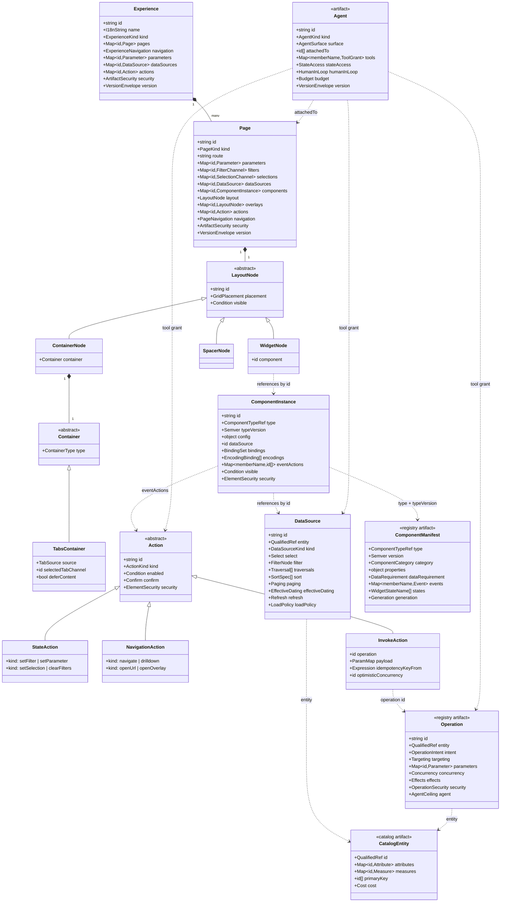
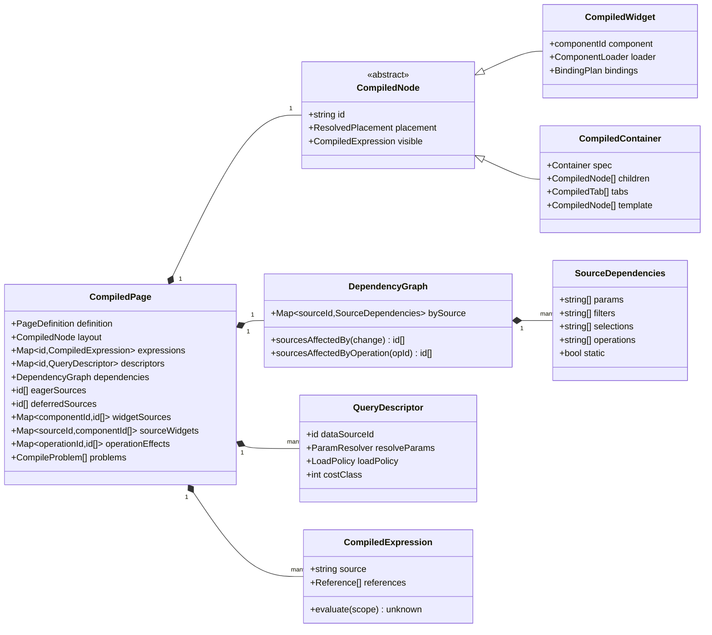
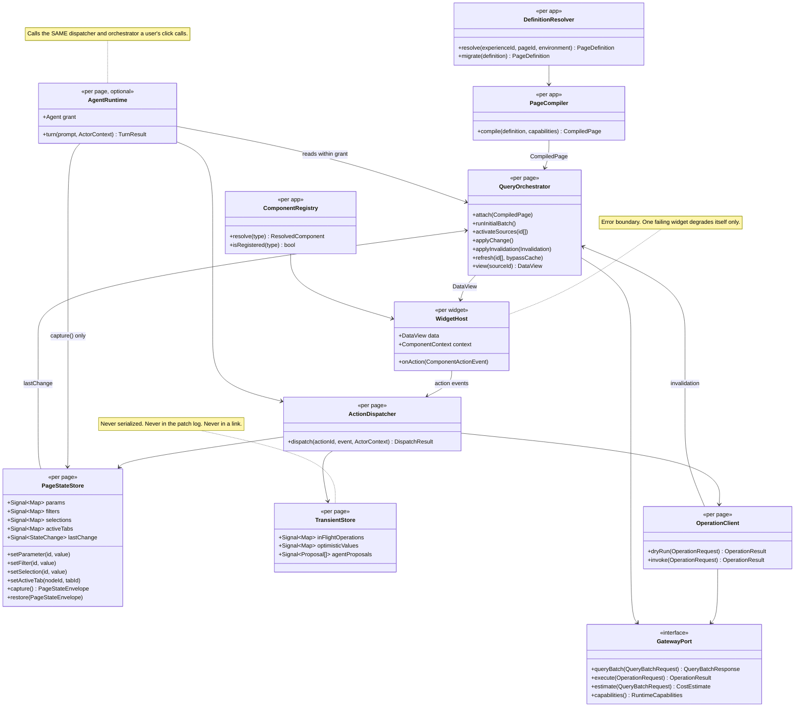
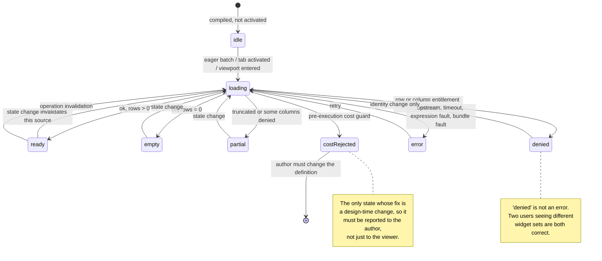
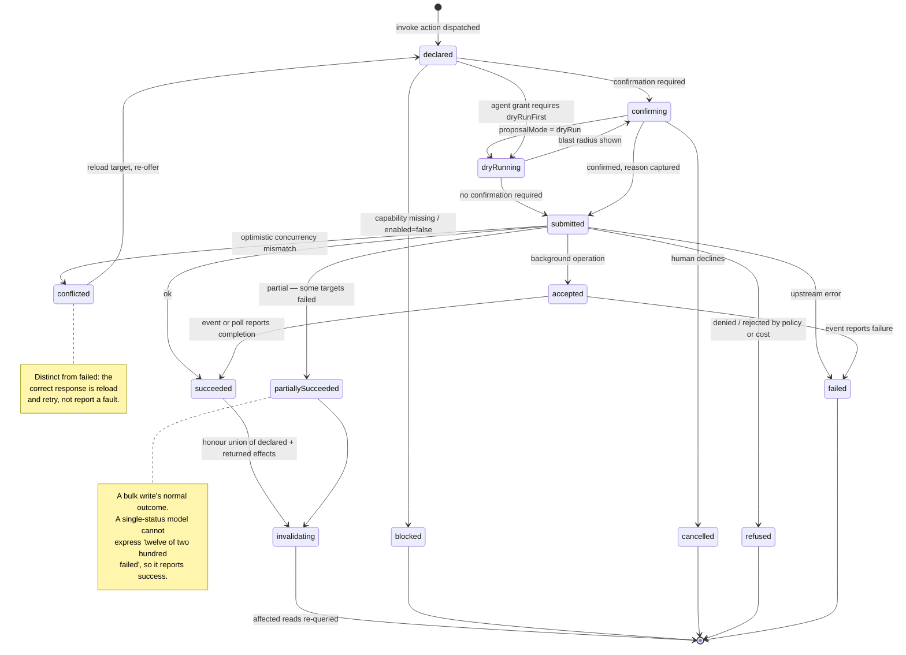
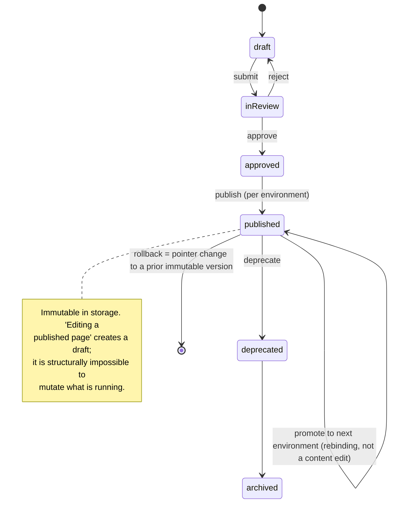
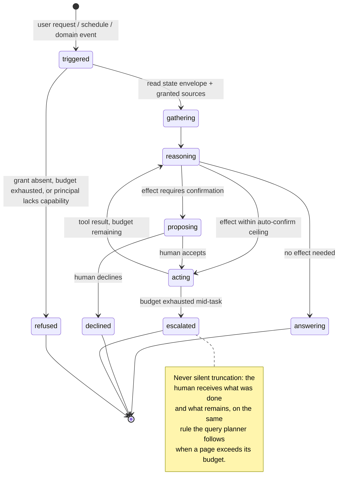
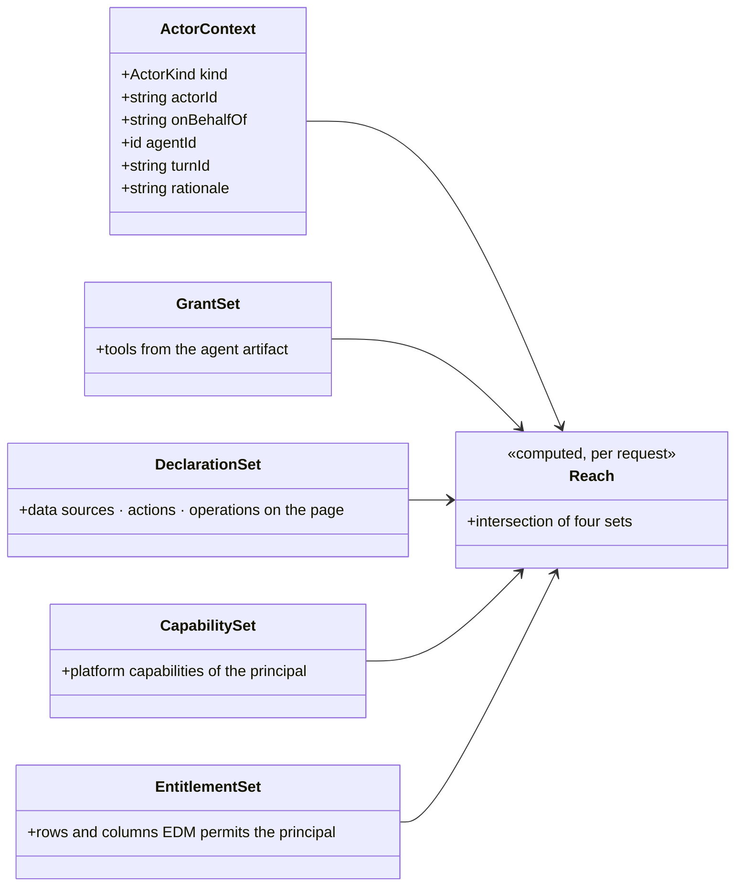

# Runtime Object Model

Status: **Draft for approval**
Part of the [Core Runtime Specification](./00-index.md).

The class diagrams, the state machines and the state tiers. Everything here is a model of *runtime* objects: the authored artifacts as the kernel sees them, the compiled plan derived from them, the services that execute it, and the actors that perturb it.

Diagrams are UML in Mermaid, and they are normative — where a diagram and prose disagree, the diagram is the specification.

---

## 1. Authored Model

What is stored, versioned, generated and edited. This is the model every subsystem binds to.

Four structural properties are visible in the diagram and each is load-bearing:

**Layout references components; it does not contain them.** `WidgetNode` holds a component *id*. This keeps JSON Patch paths into a component stable when siblings reorder, and it is what makes two-stage generation possible — plan the layout, then fill each component independently.

**Everything referenceable is a keyed map.** Not one array in the authored model holds something another part points at. Positional paths invalidate the moment anything is inserted, which would make AI-generated patches unsafe and undo unreliable.

**Actions are the only path from a component to an effect.** `ComponentInstance.eventActions` maps a manifest-declared event name to declared action ids. There is no other edge out of a component in this diagram, and that absence is what keeps components composable and interaction generatable.

**`Operation` and `Agent` attach at the edges.** `InvokeAction` points at an operation id exactly as `DataSource` points at an entity; `Agent` points at things pages already declare. Neither adds an edge *into* the page model, which is why both are additive.

---

## 2. Compiled Model

What compilation produces. Immutable, derived, and cacheable per definition version — because a published version cannot change under its own key.

`SourceDependencies.operations` is the one field this specification adds, and it is the mechanism behind law **L5**'s usefulness rather than its safety: after a write, the runtime knows which reads to re-run because compilation walked the operation registry's declared effects the same way it walks `$filter` wrappers. Without it, the only safe post-write behaviour is to re-query the entire page — which is exactly the behaviour the read-side graph exists to avoid, arriving through the back door.

`CompileProblem[]` is not an error channel. It is the record of what compilation *did not understand* — an unknown container type, an action kind this runtime does not execute — carried forward so instantiation can place a stated placeholder and telemetry can report it (law **L7**).

---

## 3. Runtime Services

The executing kernel. One instance per rendered page, except where noted.

Three things about this diagram matter more than the boxes.

**`AgentRuntime` has no edge the user's click does not have.** It reaches the dispatcher, it reads views, it captures state. It does not touch the compiler, the registry, or the gateway directly. That is law **L6** expressed as a dependency graph, and it is checkable by an architectural test rather than by review.

**`GatewayPort` is an interface with four methods and no fifth.** Reads, writes, cost estimates, capabilities. A service that needs a private call is a service that has escaped the single enforcement point.

**Only `ActionDispatcher` writes `PageStateStore`.** Every other collaborator reads. In the implemented runtime this held by convention and was violated once — the renderer wrote a tab channel directly, and the re-query that should have followed did not happen, because "re-query on change" had been a property of the dispatcher rather than of the state. The fix was to make the orchestrator react to the state's own change signal. The lesson generalizes: **an invariant enforced by one caller's discipline is not an invariant**, and this diagram should be read as forbidding a second writer rather than merely not showing one.

---

## 4. The Five State Tiers

Four tiers were specified in the frontend architecture. This specification adds the fifth, and the addition is the point: without it, in-flight writes have nowhere to live except a tier that is either saved, cached, or undone.

| # | Tier | Owner | Lifetime | Contents | Never contains |
|---|---|---|---|---|---|
| 1 | **Session** | Root injector | Login → logout | User, tenant, roles, capabilities, locale, theme, flags | Page or definition state |
| 2 | **Definition** | `DefinitionStore`, per open artifact (Studio only) | Editing session | The authored document, patch log, undo/redo, validation results | Server data; selection; transient state |
| 3 | **Page runtime** | `PageStateStore`, per rendered page | Page view | Params, filters, selections, active tabs | Data rows; entitlement decisions |
| 4 | **Transient** | `TransientStore`, per rendered page | Until settled | In-flight operations, optimistic values, unaccepted agent proposals, dry-run results | Anything a link or a save should reproduce |
| 5 | **Server data** | `QueryCache` | TTL-bounded, cross-page | Query results keyed by `(sourceId, paramsHash, entitlementScopeHash)` | Anything authored |

The prohibitions are the useful column, and three of them are security or correctness properties rather than tidiness:

- **Tier 5 must never merge into tier 2.** Server data in the definition store gets serialized into saved definitions, captured in undo history, and shared across entitlement scopes. The third is a data leak.
- **Tier 4 must never merge into tier 3.** Tier 3 is captured into links and restored from them (§5). A link that resurrects a half-finished write is a governance defect, not a UX quirk.
- **Selection belongs to tier 3, not tier 2.** Settled while building the visual builder: selection is not an edit, and putting it in the patch log makes undo step backwards through clicks.

---

## 5. State Machines

### 5.1 Widget state

The six states every data-bound component implements. Mandated rather than encouraged, because a generated page has no moment where a developer notices the empty state is missing.

### 5.2 Operation lifecycle

New with this specification. The states exist because a write has outcomes a read does not: it can conflict, it can partly succeed, and it can still be running when the user has moved on.

### 5.3 Artifact lifecycle

Unchanged from the governance model, restated because the runtime's obligations differ per state — and because agents and operation registries are artifacts under the same machine.

### 5.4 Agent turn

---

## 6. Actor Model

One entry point per actor kind, and the same checks behind all of them.

**Reach = grant ∩ declarations ∩ principal capabilities ∩ EDM entitlements.**

Each term removes a different failure. Without the grant, an agent can do anything its principal can — which is not what "assign breaks" means. Without the declarations, an agent reaches past the page it is attached to, and reviewing the page no longer tells you what can happen on it. Without the principal's capabilities, an agent becomes a privilege escalation path. Without the gateway's entitlements, everything above is theatre, because the client computed it.

The order also matters operationally: the first three are computed platform-side and produce a *refusal the user can understand* ("this assistant may not waive breaks"), while the fourth is resolved at the gateway and produces `denied`. Collapsing them into one check would make every refusal indistinguishable.

| Actor kind | Entry point | Principal | Extra obligations |
|---|---|---|---|
| `user` | Gesture → component event → `eventActions` → dispatcher | Themselves | None beyond the action's own `confirm` |
| `schedule` | Timer → dispatcher | Required `onBehalfOf` | Cannot satisfy an interactive confirmation, so it may only dispatch actions and operations that require none |
| `agent` | Turn → dispatcher, within grant | Required `onBehalfOf` | Rationale recorded; dry-run before write where the grant requires it; budget enforced server-side |
| `system` | Migration, cache invalidation, health probe | Platform | Never touches tenant data; carries no page context |

---

## 7. What the Object Model Deliberately Omits

| Omission | Why |
|---|---|
| A `Workflow` or `Process` class | A workflow application is a page over a task entity with operations. Adding a process class to the runtime would put a state machine in the interpreter, and the engine belongs in its own product surface. |
| A `Widget` class distinct from `ComponentInstance` + `WidgetNode` | The split already exists as configuration versus placement. A third object would need a third patch path. |
| A component-to-component reference of any kind | Coordination goes through declared channels. A direct reference is invisible to the validator and to the AI, and it is how a component library forks into composable and non-composable halves. |
| An `AgentSession` persisted across turns | Conversation memory is the definition and the state envelope, not a transcript. Persisting turns would reintroduce unbounded context growth and state drift, and would put model output in a tier that is saved. |
| A client-side entitlement cache | Entitlement decisions live in the gateway's response and in the cache *key*, never as a client object that could be consulted instead of asking. |
