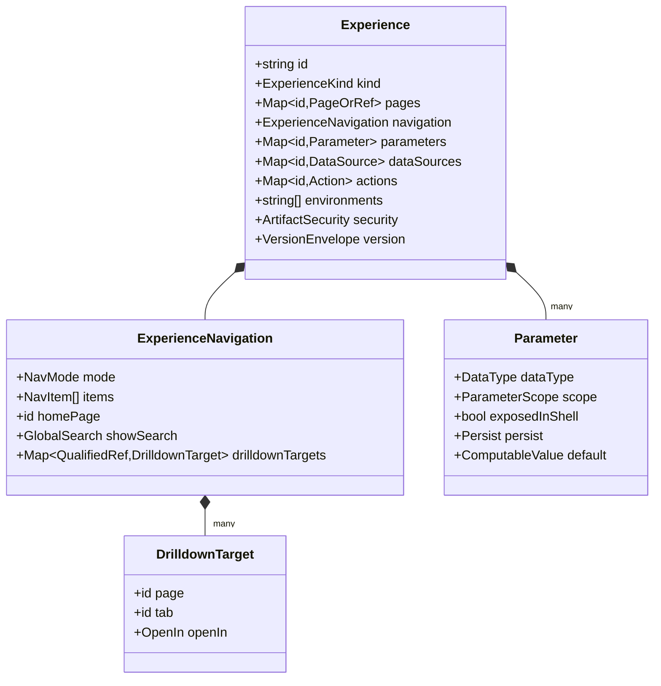
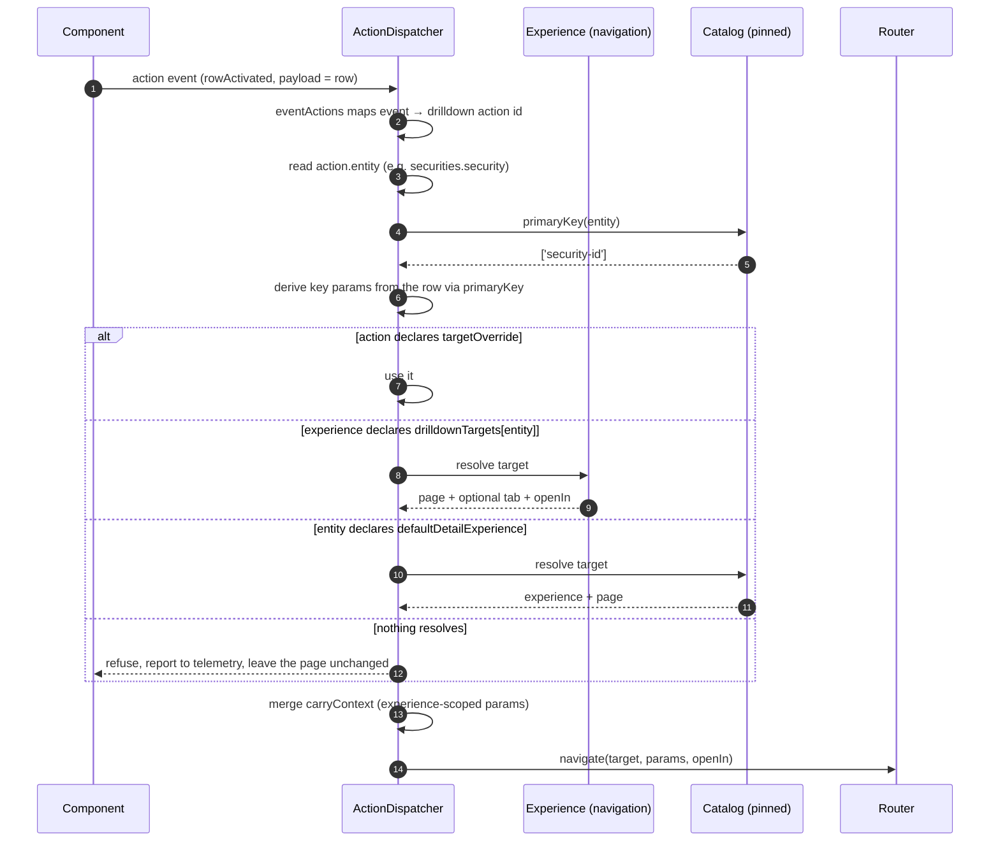

# What Is an Experience?

Status: **Draft for approval**
Part of the [Core Runtime Specification](./00-index.md) · Answers question 1.

---

## 1. Definition

> An **Experience** is a versioned application boundary: a set of pages, the state they share, the graph they navigate, and the governance envelope they are published under.

It is not a folder of pages. Four properties make it a boundary rather than a grouping, and each is something a page cannot express alone:

| Property | What it means | Why it cannot live on a page |
|---|---|---|
| **Shared state contract** | Experience-scoped parameters survive navigation between pages | An as-of date chosen on a dashboard must still hold after drilling into a detail page. If the scope belonged to a page, every hop would reset it, and the platform would feel like a set of unrelated reports |
| **Navigation graph** | The shell, the page set, and `drilldownTargets` per entity | Drill-down must be resolvable by *entity*, not by page: "open a security" has one answer per experience, so adding a detail page re-aims every existing drilldown at once |
| **Governance envelope** | The unit of publication, approval, promotion and rollback | Approving thirty pages individually is not review, it is ceremony. The reviewed thing must be the thing that ships |
| **Entitlement-to-view boundary** | Platform authorization is granted over an experience | Per-page platform permissions would produce experiences whose navigation leads to walls |

---

## 2. Structure



`pages` holds either an inline page or a `{ $pageRef }`. Both forms exist for a practical reason: a small experience is easier to review as one document, and a large one must not be a single 4,000-line artifact that two authors cannot edit concurrently. The runtime resolves either without caring which was used.

---

## 3. Shared State, and Why Scope Is Three-Valued

A parameter declares a scope, and the three values are not degrees of the same thing — they are three different lifetimes with three different owners.

| Scope | Lives for | Written by | Example |
|---|---|---|---|
| `page` | One page view | The page's own actions and its URL | The active tab, a page-local threshold |
| `experience` | The navigation session within the experience | Any page in it; carried by `carryContext` | `as-of` date, business-date basis |
| `session` | Login to logout | The shell | Preferred currency, default desk |

The consequence worth stating: **experience scope is what makes drill-down feel like one application.** A steward sets an as-of date on the dashboard, drills into a security, drills again into its issuer, and is still looking at the same business date. Under page scope every hop silently resets to today, and the numbers on the detail page would not reconcile with the numbers that led there — a defect that reads as a data problem rather than a state problem, which is what makes it expensive to diagnose.

`persist: session | user` is deliberately separate from scope. Scope decides *how far the value travels*; persistence decides *whether it comes back tomorrow*. A currency preference is session-scoped and user-persisted; an as-of date is experience-scoped and normally not persisted at all, because a stale business date silently applied on Monday morning is worse than choosing one.

---

## 4. Kinds, and What They Must Not Do

```
ExperienceKind = application | single | process
```

`kind` selects **authoring** behaviour: which shell chrome the Studio offers, which exemplars generation retrieves, whether the navigation tree is even shown. It selects nothing at runtime.

This is law **C1** at the experience level, and it deserves the same emphasis it gets for pages. A `process` experience is not a different runtime hosting a workflow engine; it is an experience whose pages declare `invoke` actions against a task entity. The moment `kind: process` selects a code path, "add an agent console" becomes a fourth runtime, and the platform's extensibility story becomes a switch statement.

---

## 5. Drill-Down Resolution

The single most reused mechanism in the four EDM templates, and worth specifying precisely because two things resolve it.



Three points the sequence makes that prose tends to lose:

**Key derivation comes from the catalog, not the page.** The author does not write `security-id` mappings; the entity's `primaryKey` supplies them. This is why a drilldown authored against one entity keeps working when a steward adds a compound key — and why a component can offer drill-down without knowing the page graph exists.

**Resolution has four rungs and a refusal.** Override, experience target, entity default, then nothing. The last rung matters: an unresolvable drilldown must leave the page as it was and report itself, never navigate somewhere plausible. Navigating to a "closest match" is how a user ends up looking at the wrong instrument and believing it is the right one.

**`carryContext` is a merge, not a copy.** Experience-scoped parameters travel; page-scoped ones do not. Copying everything would carry a page-local filter into a page where it means something different, which is the subtler of the two failure modes and the harder to notice.

---

## 6. Environments and Promotion

An experience declares which environments it may be published to; the definition itself is environment-agnostic.

```
Definition          "dataSourceId": "ds.dq-exceptions"       ← logical, immutable
                                    │
Gateway resolves    experience_binding[tenant, environment]   ← physical target
                                    │
EDM                 UAT cluster / Prod cluster
```

A version published to UAT and promoted to Prod is **byte-identical**; only the binding row differs. Three consequences, all governance rather than convenience:

- Promotion is an approval plus a pointer change, so the audit chain from generation through review to production is unbroken.
- The version a reviewer approved is provably the version running.
- Rollback is a pointer change to a prior immutable version, with nothing reconstructed.

This specification adds one requirement to promotion: **the target environment's runtime capability descriptor is checked at promote time** ([`08-evolution.md`](./08-evolution.md) §4). An experience invoking operations must not be promotable into an environment whose runtime does not execute them — the failure would otherwise appear as buttons that do nothing, discovered by a user.

---

## 7. Experience-Level Data Sources and Actions

Both exist, and both are easy to misuse.

**Experience data sources** serve the shell: a navigation badge counting items needing attention, a global search. They are queried once per experience session rather than per page, which is the entire justification. A data source placed here to be "shared" between pages is a mistake — pages are compiled and cached independently, and a shared source turns two independent renders into one dependency.

**Experience actions** are the ones every page offers: go home, change the as-of date, open the runbook. A page-specific action declared here is reachable from pages where it makes no sense, and `enabled` conditions accumulate to compensate.

The rule: **experience scope is for things the shell owns, not for things two pages happen to share.** Sharing is what the catalog and the operation registry are for.

---

## 8. Agents Attach Here

An agent's `surface` is `page`, `experience` or `platform`. The experience surface is the interesting one: it is what lets an assistant *navigate* — narrow the dashboard, open the instrument, look at its issuer — because those are declared actions on pages within one boundary.

The boundary is also the security bound. An experience-surface agent may reach the pages listed in `attachedTo`, and its reach on each is still the intersection described in [`01-object-model.md`](./01-object-model.md) §6. An agent cannot cross into another experience, because nothing in its grant can name one: `tools` reference ids resolved within the experience it is attached to.

---

## 9. Decisions Requiring Ratification

| # | Decision | Consequence if reversed later |
|---|---|---|
| E1 | The experience is the unit of publication, promotion and platform entitlement | Per-page governance, which is ceremony rather than review |
| E2 | Three parameter scopes with distinct lifetimes; `persist` is orthogonal to scope | Drill-down silently resets business context, and defects read as data problems |
| E3 | `ExperienceKind` never branches the runtime | Each application class becomes its own runtime |
| E4 | Drill-down resolves by entity through a four-rung chain, and refuses rather than approximates | Every page hard-codes its targets; an unresolvable drilldown shows the wrong record |
| E5 | Definitions are environment-agnostic; only bindings differ | Promotion becomes a content edit and the audit chain breaks |
| E6 | Promotion checks the target runtime's capability descriptor | Version skew is discovered by users as affordances that do nothing |
| E7 | Experience scope is for shell-owned concerns, not for sharing between pages | Independent page renders acquire a shared dependency |
