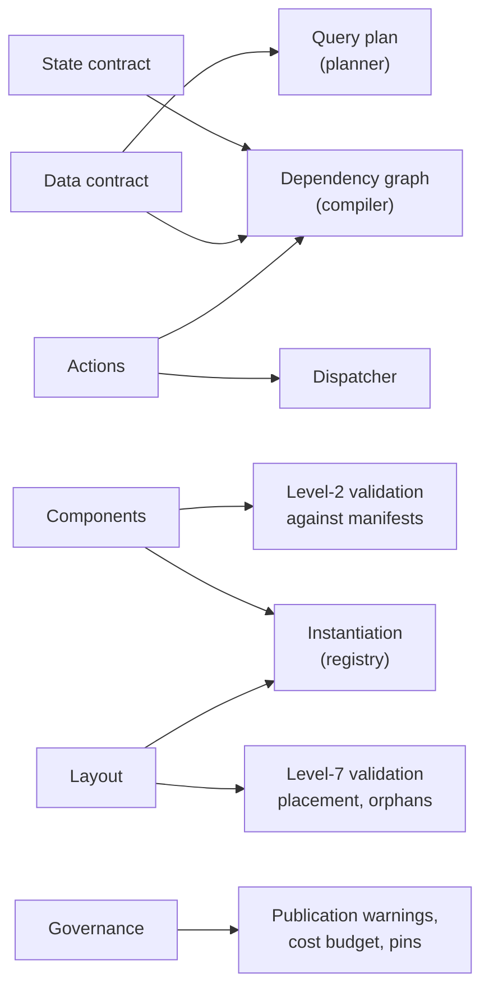
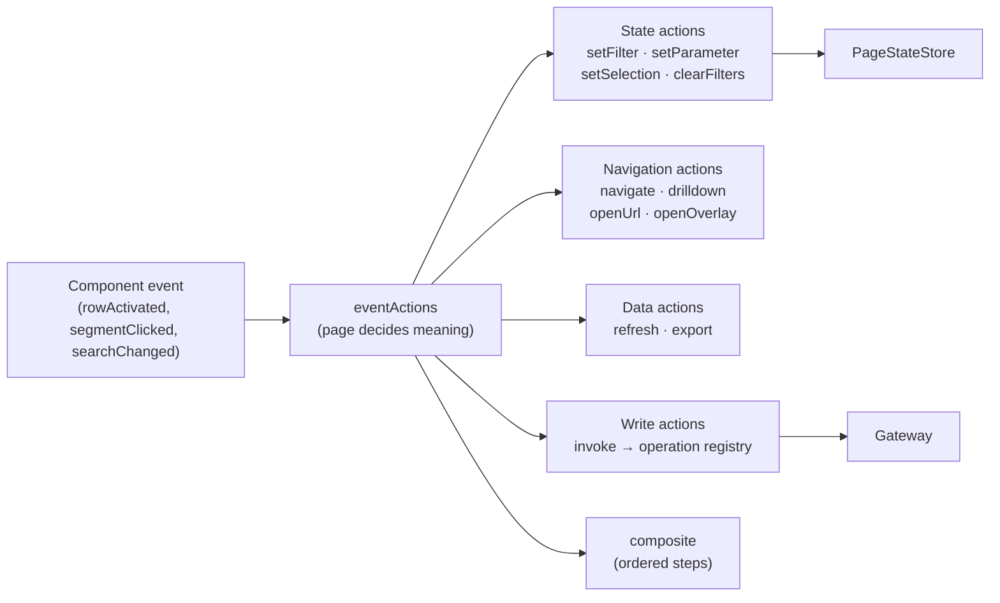

# What Is a Page?

Status: **Draft for approval**
Part of the [Core Runtime Specification](./00-index.md) · Answers question 2.

---

## 1. Definition

> A **Page** is a declared pure function:
>
> ```
> render : (Definition, PageState, Data, Identity) → View
> ```
>
> Its declaration has exactly six parts: a **state contract**, a **data contract**, the **vocabulary in use**, a **structure**, a **behaviour set**, and a **governance envelope**.

Everything that follows in this document is a consequence of taking the function signature literally.

**Determinism.** Same four inputs, same view. No model call, no ambient clock read outside declared expressions, no component fetching something of its own. This is what allows a page to be tested, screenshotted for a regulator, reproduced from a defect report, and served while a model provider is down.

**Identity is an input, not a modifier.** Two users open the same definition with the same state and legitimately see different views — twelve widgets versus nine plus three `denied`. Both are correct renders of the same function, because identity is an argument. Treating entitlement as a post-hoc adjustment to one canonical view is the conceptual error that produces either a leak or an unusable product.

**The four arguments have four owners.** The definition is authored and versioned; state is owned by the page's runtime store; data is owned by the gateway; identity is owned by the IdP and EDM. No part of the runtime owns two of them.

---

## 2. The Six Declarations

| Declaration | Contents | The question it answers |
|---|---|---|
| **State contract** | `parameters`, `filters`, `selections` | What can vary, and how far does each variation travel? |
| **Data contract** | `dataSources` | What questions does this page ask, and how expensive are they? |
| **Vocabulary in use** | `components` | Which registered contracts, at which versions, configured how? |
| **Structure** | `layout`, `overlays` | Where does everything sit, at every breakpoint? |
| **Behaviour** | `actions`, `navigation` | What may happen, and what does each happening mean? |
| **Governance** | `security`, `version`, `performance` | Who is it for, what is it bound to, what is it allowed to cost? |

The split is not organisational. Each part has a different consumer, and the separation is what makes them independently generatable, patchable and validatable:



---

## 3. State Is Declared, Not Discovered

Three channel kinds, and the distinction between them is functional rather than stylistic.

| Kind | Semantics | Deep-linkable | Written by |
|---|---|---|---|
| **Parameter** | A typed input the page needs to mean anything — a record id, an as-of date | Always, when scope permits | The route, the shell, `setParameter` |
| **Filter channel** | A shared narrowing that several widgets may read | When `syncToUrl` | `setFilter`, `clearFilters` |
| **Selection channel** | What the user has picked out, as key fields | When `syncToUrl` | `setSelection` |

Why three rather than one bag of values:

- A **parameter** is a precondition. A detail page without its `security-id` is not a page with a missing filter; it is a page that cannot render, and the runtime must say so rather than showing an empty shell.
- A **filter** is optional by construction. `skipWhenEmpty` defaults to `true` precisely so an unset filter means "no constraint" — the single most common cause of mysteriously empty dashboards is the opposite default.
- A **selection** is an identity, not a value. It carries the key fields a channel declares, never a row index (which does not survive a re-query) and never a whole row (which would put data in state).

**The three are declared so that interaction is generatable and analysable.** A filter channel in JSON can be written by a model and read by the compiler. Coordination living in component code can be neither, which is the whole reason this platform declares state rather than letting components hold it.

### 3.1 State is capturable

This specification requires that page state be serializable as a defined envelope — `schemas/page-state.schema.json`:

```json
{
  "pageId": "exception-management",
  "definitionVersion": 1,
  "params":     { "as-of": "2026-08-05", "age-threshold-hours": 48 },
  "filters":    { "severity": ["HIGH"], "status": null, "active-rule": "DQ-PRICE-STALE" },
  "selections": { "focused-exception": [{ "exception-id": "EXC000412" }] },
  "activeTabs": { "rule-tabs": "DQ-PRICE-STALE" }
}
```

Four consumers need exactly this and nothing more: a deep link, a workspace restore, a support bundle, and an agent's view of what the user is looking at. Two properties are non-negotiable and are stated in the schema itself: **no data rows** (state is what was asked, not what came back) and **no entitlement decisions** (those resolve from identity per request; a decision travelling in a link is an authorization bypass).

One detail earns its place: `"status": null` is not the same as `status` being absent. Absent means never set; null means explicitly cleared. Losing the distinction means a cleared filter comes back set on restore — which the user experiences as the platform disagreeing with them about what they just did.

---

## 4. `kind` Is a Label, Never a Branch

```
PageKind = dashboard | search | detail | workspace | process | blank
```

`kind` drives **design-time** behaviour: layout heuristics in the generator, default page actions in the Studio, and which exemplars retrieval offers. The renderer must never switch on it.

This is correction **C1** of [`00-index.md`](./00-index.md), and it is the single most important rule in this document, because it is what makes the four application classes one runtime:

| `kind` | What actually differs | Runtime mechanism |
|---|---|---|
| `dashboard` | Aggregate sources, eager loading, KPI-over-detail layout | None specific |
| `search` | `search` sources, `onDemand` loading, a required input before results | None specific |
| `detail` | A required parameter, single-record sources, per-record tabs | None specific |
| `workspace` | Selection channels as a working set, `invoke` actions, `refresh.onActions` | None specific |
| `process` | A task entity, operations that advance it | None specific |

Every row's third column is the same, and it must stay that way. Verify it with an architectural test: **the renderer's source must contain no reference to `page.kind`.** That test is cheap now and impossible to add once three branches exist.

The corollary is that a workspace page is not a new kind of thing. It is a page whose behaviour set includes writes — which is why [`05-data-and-operations.md`](./05-data-and-operations.md) is where workflow support is actually decided, not here.

---

## 5. Structure: Containers, and Why Tabs Are Layout

The layout tree holds placement and structure and references components by id.

```
ContainerType = grid | stack | panel | split | drawer | tabs | repeater
```

**Tabs are a container, not navigation.** A tab partitions one page; navigation moves between pages. Conflating them makes deep-linking and deferred loading much harder — a mistake common enough to be worth naming. The consequence is visible in the model: a tab's active id is *page state* (`selectedTabChannel`), and a tab's content is *deferrable* (`deferContent`), because both are properties of a region of a page rather than of a destination.

**Data-driven tabs are the detail-page primitive.** One tab per contributing vendor, per issued instrument, per failing rule — a set the data decides, not the author. The runtime obligations are specific, and each one was learned by getting it wrong:

| Obligation | Failure if omitted |
|---|---|
| One compiled template serves every generated tab | Twelve vendors cost twelve compiled templates |
| Only the active tab's sources are activated | Twelve tabs issue twelve queries to show one |
| The **resolved** active tab is published to its channel, including the fallback to the first tab | The strip highlights one thing while the content shows another, or shows nothing where the tab filter cannot be skipped |
| Generated tab ids are deduplicated and capped | Two indistinguishable tabs, and an ambiguous active-tab lookup |
| Tab identity travels as page state, not as a hidden scope | The tab is not deep-linkable and no other widget can read it |

The last row is a deliberate narrowing from the schema, which describes a richer `$tab` row scope. Carrying the tab's *id* through a declared filter channel buys two properties the scope would not: the dependency graph stays derivable from the definition, and the active tab is page state that everything else on the page can read. A template needing a second field from its generating row would need `$tab` implemented; nothing in the four shipped templates does.

---

## 6. Behaviour: Actions Are the Only Verbs

A page's `actions` map is its complete list of what may happen. Components emit events; `eventActions` maps event names to action ids; the dispatcher executes. There is no other path from an interaction to an effect.



Three properties of the indirection, in the order they matter:

1. **It is what makes components reusable.** A table that knew a row click meant "open a security" could not appear on a page where it means "select for bulk assignment".
2. **It is what makes interaction generatable.** A model can emit an action; it cannot emit component code.
3. **It is what makes interaction analysable.** The compiler reads `setFilter.channel` and derives the invalidation graph. This is also why that channel must be a *static identifier*: a computed channel is unanalysable and unvalidatable. Dynamic routing is expressed instead as several static actions guarded by `enabled` conditions — which validates, and which a reviewer can read.

`composite` deserves one note: it is an ordered list of declared steps with `onError: abort | continue`, not a scripting seam. If a page needs conditional branching between effects, that is a workflow, and it belongs in the operation registry or the process surface rather than in a page's action map.

---

## 7. Governance Is Part of the Page

Three blocks, none of which is enforcement.

| Block | Purpose | Not |
|---|---|---|
| `security` | Intended audience, required capabilities, `deniedBehaviour`, computed `sensitivityDeclaration`, export policy | A boundary. Enforcement is the gateway's, resolved from the caller |
| `version` | `schemaVersion`, `artifactVersion`, lifecycle state, **pins** (catalog, registry, operation registry), provenance, validation record | Advisory. Pins are what make a render reproducible |
| `performance` | Render budget, max eager sources, auto-refresh | A limit the page can raise for itself past the platform's own |

`sensitivityDeclaration` is *computed at validation time from the catalog*, not authored. An author cannot understate what a page exposes, which is what makes reviewer approval meaningful rather than an act of faith in a widget title.

`security.deniedBehaviour` is worth one line of rationale: an author declares whether a denied widget shows a `denied` state or hides itself. Both are legitimate — a page targeted at a mixed audience wants the honest placeholder; a page where three quarters of widgets would be denied for one team should hide them rather than present a wall. The choice belongs to the author because only the author knows the audience.

---

## 8. What a Page Must Not Contain

| Prohibited | Reason |
|---|---|
| A physical data object name — table, column, procedure | Promotion becomes a content edit; a copied definition leaks schema |
| A colour value | Theming, dark mode and contrast stay under the design system, so a generated page cannot produce an inaccessible palette |
| An entitlement grant of any kind | The page is intent; the grant is EDM's |
| An operation's implementation | An operation is registry content; a page names it, exactly as it names an entity |
| Component code, markup, or a query in any executable form | The page is data. Data can be validated, diffed, migrated and generated; code can be none of those |
| Data rows | State is what was asked. Rows in a definition would be cached across entitlement scopes and captured in undo history |
| Agent instructions that widen reach | Prose is not a permission. An agent's reach is its declared grant, intersected — never what its brief says |

---

## 9. Decisions Requiring Ratification

| # | Decision | Consequence if reversed later |
|---|---|---|
| P1 | A page is a pure function of definition, state, data and identity | Determinism goes, and with it testability, reproduction and outage independence |
| P2 | Identity is an argument, not a post-hoc adjustment | Either a data leak or a product that cannot serve mixed audiences |
| P3 | Three distinct state channel kinds, with `skipWhenEmpty: true` by default on filters | Empty-dashboard defects, and preconditions indistinguishable from narrowings |
| P4 | `page.kind` never branches the renderer, verified by an architectural test | Four application classes become four runtimes |
| P5 | Page state is a defined serializable envelope with no rows and no entitlement decisions | Four consumers invent four encodings; a link eventually carries an authorization |
| P6 | Tabs are layout; the active tab is page state | Deep-linking and deferred loading both become special cases |
| P7 | Actions are the only verbs, and `setFilter.channel` is a static identifier | The invalidation graph stops being derivable; dynamic channels are unvalidatable |
| P8 | `sensitivityDeclaration` is computed, never authored | Reviewer approval becomes ceremonial |
