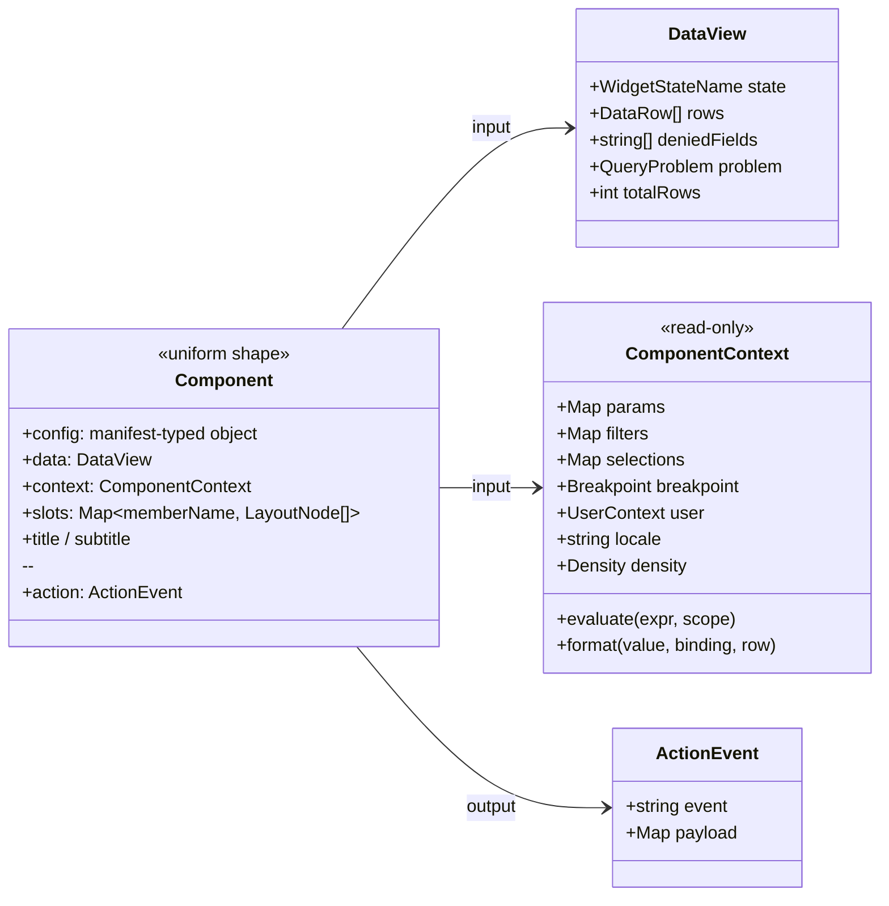

# What Is a Component?

Status: **Draft for approval**
Part of the [Core Runtime Specification](./00-index.md) · Answers question 3.

---

## 1. Definition

> A **Component** is a context-free presentation function whose contract is a machine-readable manifest:
>
> ```
> present : (config, data, context, slots) → View
> report  : interaction → ActionEvent
> ```
>
> It renders what it is given and reports what happened. It never fetches, never navigates, never writes page state, and never knows what page it is on.

The uniformity is what lets the renderer treat components as interchangeable and lets a model emit any of them without special cases. A single component that reached for a service would end that property for the whole library.

---

## 2. The Contract



### Inputs

| Input | Owner | Notes |
|---|---|---|
| `config` | The definition | Typed from the manifest's `properties` JSON Schema. Generated types make manifest/implementation drift a compile error |
| `data` | The gateway, via the orchestrator | Exactly one of six states. A component cannot be handed an inconsistent combination such as "loading with rows" |
| `context` | The page's state store | **Read-only.** Params, filters, selections, breakpoint, identity summary, locale, and two functions: `evaluate` and `format` |
| `slots` | The definition | Child layout nodes, for containers and composites |

### Output

One output: `action`, carrying an event name declared in the manifest and a payload. The page decides what it means.

### Why `context` is read-only

A component that wrote page state would be a second writer, and a second writer means the invalidation that should follow a change becomes conditional on which writer made it. That failure has already occurred once in this codebase in a narrower form: the renderer wrote a tab channel directly while re-query lived in the dispatcher, and the tab strip changed while its content did not. Components are the population most likely to reproduce it at scale, which is why the prohibition is structural rather than advisory — `ComponentContext` exposes no setter to expose.

---

## 3. The Manifest, and Its Five Consumers

Each component ships `component.manifest.json` beside it. One file, five consumers, all authoritative:

| Consumer | Uses |
|---|---|
| **Renderer** | Instantiation, slot wiring, declared inputs, skeleton dimensions |
| **Validator** | Level 2 — does this instance's `config` conform to `properties` at the pinned registry version? |
| **Studio** | Palette entry and a *generated* inspector form. Hand-built inspectors are why low-code platforms stop adding components |
| **Generation service** | The reduced `generation` projection is the model's emit vocabulary |
| **Agent runtime** *(new)* | Which events a component can emit, hence which page actions an agent can plausibly trigger through a widget rather than by naming an action |

Two mechanisms keep it honest, and they are the difference between a contract and a document:

- **Generated config types.** The component declares its input using a type generated from the manifest. Divergence is a build failure, not a review finding.
- **Registry/manifest agreement in CI.** A manifest without a registry entry, or an entry without a manifest, fails the build.

---

## 4. The Six States Are Mandatory

```
ready · loading · empty · partial · error · denied
```

Mandated rather than encouraged, and the reason is specific to this platform: **a generated page has no moment where a developer notices the empty state is missing.** A human author sees an empty grid and fixes it. The model emits a definition and moves on, so state coverage has to already exist in the component tier. Mandating it there is what makes every generated page complete by construction.

| State | Means | Must not be |
|---|---|---|
| `ready` | Rows, rendered | — |
| `loading` | Query in flight; skeleton from the manifest | A spinner that causes layout shift |
| `empty` | The question was valid and the answer is nothing | An error |
| `partial` | Truncated rows, or some columns denied — renders what is permitted and says what is not | Silently complete |
| `error` | Upstream fault, timeout, expression fault, bundle fault. Offers retry | Where `denied` is reported |
| `denied` | The caller may not see this. Reads as "not available to you" | An error variant |

`denied` being distinct is not a nicety. It is the state that makes a mixed-entitlement page work: two users open one definition, one sees twelve widgets and the other nine plus three `denied`, and both renders are correct. Folding it into `error` would make normal governed operation look like a fault, and would train users to ignore faults.

---

## 5. Tiering

| Tier | Examples | Rule |
|---|---|---|
| **Design-system primitives** | Button, field, menu, dialog, table shell | Know nothing about definitions or data. Reusable in Studio chrome |
| **Layout** | grid, stack, panel, tabs, split, drawer, repeater | Own slots and responsive behaviour. Never bind data |
| **Data** | table, tree, relationship viewer | Bind one data source. No domain semantics |
| **Input** | filter bar, search box, and later: forms | Write nothing. Emit events the page maps to actions |
| **Analytics** | KPI card, chart, trend, gauge | Bind one data source. No domain semantics |
| **Content** | text, media | Structure a page without binding a data shape |
| **Business composites** | Exception queue, approval panel | **Compositions of the tiers above**, with domain defaults |

The composite rule is the one that decides whether the library stays maintainable. An exception queue is a table plus filters plus bulk-action affordances with domain defaults — not a new widget with its own table code. If composites may reach for raw DOM and raw data, the library forks into two incompatible halves and the second is unmaintainable.

**Input components are the tier that changed most recently, and the lesson is worth recording.** Four component types shipped first and not one accepted input, so *search* — one of three v1 journeys — was unexpressible. A vocabulary gap does not announce itself; it appears as a journey nobody can build. The category had been reserved in the manifest schema from the start, which is why filling it cost one component and no schema change.

### 5.1 Two rules for input components

Input components are the tier most likely to erode law **L3**, so their obligations are stated explicitly:

1. **They emit, they do not write.** A filter bar emits `searchChanged`; the page maps it to `setFilter`. The indirection is what keeps the dependency graph derivable — the compiler learns which sources a filter change invalidates by reading the definition, not by observing components.
2. **Debouncing is the component's job.** A search box dispatching per keystroke issues a query per keystroke, and since every widget reading the channel re-queries, that is a dashboard's worth of round trips per letter typed. The component holds a local echo during the debounce window and releases it once the channel is authoritative again — so typing stays responsive while the page stays consistent.

---

## 6. Write-Capable Components (v2)

Workflow applications need components that *offer* writes. This is where the temptation to break the contract is strongest, so the rule is stated before the capability exists:

> **A component never performs a write. It emits an event; the page maps it to an `invoke` action; the dispatcher executes the operation.**

| Concern | Where it lives |
|---|---|
| The button, its label, its emphasis | Component config, or the page's action declaration |
| Whether the button is enabled | The action's `enabled` condition, evaluated against page state |
| Whether the user may perform it | The action's `security.requiredCapabilities`, then the gateway |
| The confirmation dialog and reason capture | The dispatcher, from the action's and the operation's `confirm` blocks |
| Idempotency key, concurrency token | The dispatcher, from the operation's registry entry |
| What to re-query afterwards | The orchestrator, from declared effects unioned with the response |

A component that owned any row of that table would need injection, would be unpreviewable and untestable in isolation, and would become a second write path. The one thing a component legitimately gains for write support is the ability to render an operation's *pending* state — which arrives as another `DataView`-shaped input from the transient store, not as knowledge of the operation.

**Forms are the case to watch.** A form is an input component whose config declares fields bound to operation parameters — generated from the operation registry the way an inspector is generated from a manifest. It collects values and emits one event carrying them. It does not validate against EDM, does not submit, and does not know what happens next.

---

## 7. Unknown Components Degrade

An unrecognised `type`, or a `typeVersion` the pinned registry does not contain, resolves to a **stated placeholder** in the widget's slot: the rest of the page renders, telemetry records the type and the definition version, and the Studio surfaces it as a validation finding.

Never a blank page, and never a silent omission. Registry/definition version skew is a *normal* condition in a multi-version platform, not an exceptional one — and a placeholder is the difference between "this platform is versioned" and "this dashboard is broken". The general form of this rule for every vocabulary axis is in [`08-evolution.md`](./08-evolution.md) §3.

---

## 8. Decisions Requiring Ratification

| # | Decision | Consequence if reversed later |
|---|---|---|
| CM1 | One uniform component shape: `(config, data, context, slots) → view + action` | The renderer needs per-component special cases; the model needs per-component prompting |
| CM2 | `context` is read-only; components never write page state | A second writer, and conditional invalidation |
| CM3 | Components never fetch, never navigate | Batching, preview, fixture testing and single-gateway enforcement all break |
| CM4 | The manifest is authoritative for five consumers, with generated config types | Contract drift becomes unavoidable as the library grows |
| CM5 | Six mandatory states, with `denied` distinct from `error` | Generated pages ship with holes; governed operation reads as failure |
| CM6 | Business composites are compositions, never bespoke implementations | The library forks; half of it is unmaintainable |
| CM7 | Input components emit; they never write. Debouncing is theirs | A query per keystroke, times every widget on the channel |
| CM8 | Write-capable components emit an event; the dispatcher performs the operation | Components become a second write path with no audit and no concurrency |
| CM9 | Unknown component types degrade to a stated placeholder | Version skew becomes an outage |
