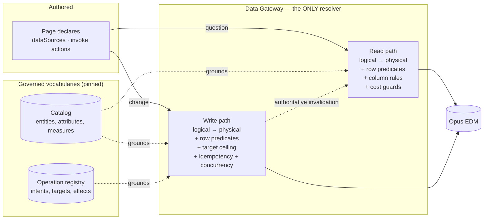
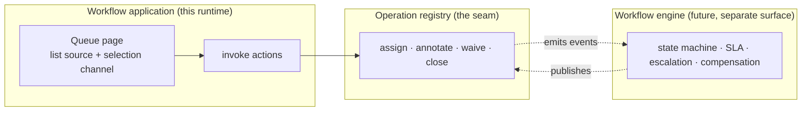

# What Is a Data Source? — and Its Mirror, the Operation

Status: **Draft for approval**
Part of the [Core Runtime Specification](./00-index.md) · Answers question 4.
Introduces: [`../../schemas/operation.schema.json`](../../schemas/operation.schema.json) · example: [`../../schemas/examples/exception-management.operations.json`](../../schemas/examples/exception-management.operations.json)

This is the document where workflow support is decided. Not in the page model, and not in a new page kind — here, in the shape of a write.

---

## 1. Definition

> A **Data Source** is a declarative logical *question* about the semantic catalog. It names an entity, a kind, what to select, how to filter, how to traverse, how to sort and page, and at what effective date. It contains no SQL, no physical object, and no answer.
>
> An **Operation** is the same thing with the arrow reversed: a declarative logical *change*. It names an entity, an intent, what it targets, what parameters it takes, how it handles concurrency, and what it invalidates.



The symmetry is the design. One authorization path, one audit path, one cost-guard path, one cache-invalidation path. Asymmetry here is what produces a second data plane — and a second data plane is where the entitlement bug lives, because it is the one that was not adversarially tested.

---

## 2. The Read Model

| Part | Purpose | Detail that carries weight |
|---|---|---|
| `entity` | The catalog concept being asked about | Never a table |
| `kind` | `aggregate` · `list` · `single` · `search` · `graph` | Closed set: the planner and the gateway must both know every member |
| `select` | Attributes, measures with aggregations, dimensions, key, search term | **Aliases**, not catalog refs, are what bindings reference — so a steward can re-point an attribute without touching component config |
| `filter` | A recursive `all` / `any` / `not` tree of clauses | `skipWhenEmpty` defaults to `true`: an unset channel means *no constraint*, not *match nothing* |
| `traversals` | Declared relationship hops | Join semantics are a catalog decision made once by a steward, not a per-page choice — getting it wrong makes a dashboard silently under-report |
| `effectiveDating` | `asOf` / `knownAs` | Bitemporality is in the model from v0.1 because retrofitting it makes a large class of EDM questions unanswerable |
| `loadPolicy` | `eager` · `deferred` · `onDemand` | The first-batch budget's control surface |
| `refresh` | `onLoad` · `interval` · `manual` · `onAction` | `onAction` is the read side of the write loop |

### 2.1 Computable values are wrapped, and that is why invalidation is cheap

A value resolved at runtime uses an explicit wrapper: `{$param}`, `{$filter}`, `{$selection}`, `{$context}`, `{$expr}`.

The first four are distinct forms rather than one general expression on purpose. The compiler derives the **entire** dependency graph by walking JSON — no expression parsing on the hot path — which is what lets a filter change re-query three widgets instead of twelve. Every low-code platform that feels slow on interaction has made the opposite choice.

### 2.2 Search needs no new primitive, but it needs one planner rule

A search experience is: `kind: search`, `loadPolicy: onDemand`, an entity marked `cost.requiresFilter`, and an input component writing a filter channel.

The one gap: **`onDemand` must actually mean "not until there is input"**, distinct from `deferred` ("not until visible"). Today's planner partitions eager from deferred; an `onDemand` source treated as deferred fires as soon as its region is on screen, which for a search page means scanning the universe on open. The rule:

> An `onDemand` source does not query until every filter clause that has `skipWhenEmpty: false` — or that targets a `requiresFilter` entity — resolves to a value.

This is a planner predicate, not a new concept, which is exactly the test §5 of [`00-index.md`](./00-index.md) sets for a new application class.

---

## 3. The Write Model

### 3.1 Why an operation is registry content, not page content

A page names an operation exactly as it names an entity. It does not describe one. The three reasons are the same three that keep physical objects out of definitions:

| If operations were declared in pages | Consequence |
|---|---|
| A page could invent a write | The validator has nothing to check it against, and the gateway is asked to execute a shape no steward approved |
| A write's shape could change per page | Two pages approve exceptions differently, and the audit trail cannot be reconciled |
| A published page would carry its write's implementation | Promotion becomes a content edit, and a copied definition leaks the write path |

So the operation registry is an **immutable published snapshot**, like the catalog, and a definition that invokes an operation pins `operationRegistryVersion`. That pin is what makes a published page's writes reproducible: same definition, same catalog, same component contracts, same write semantics.

### 3.2 The parts of an operation, and what each prevents

| Part | Prevents |
|---|---|
| `intent` (closed set) | An unclassifiable write. Intent decides default confirmation, whether the operation is offered on a multi-row selection, and whether an agent may ever auto-confirm it. `custom` is treated as destructive |
| `targeting.mode` — `single` · `selection` · `filter` · `none` | Client-side enumeration of a bulk target. Closing 4,000 breaks must not require shipping 4,000 keys; the *filter the user was looking at* is the target |
| `targeting.maxTargets` | An unbounded write — the write-side equivalent of an unfiltered scan |
| `parameters`, `boundToAttribute` | Hand-built forms. An operation form is generated from metadata, as an inspector is generated from a manifest |
| `concurrency` (`version` · `timestamp` · `etag`) | A silent overwrite of someone else's change. A mismatch is a typed `conflict`, whose correct response is *reload and retry*, not *report a fault* |
| `idempotency` | A retried approval landing twice — a governance incident, not a UX blemish |
| `effects` | An unknown blast radius, and a page that must hand-wire its own refresh |
| `security.confirmation` / `requiresReason` / `auditProfile` | Consequential writes performed accidentally, and audit rows that cannot answer "why" |
| `security.reversible` / `compensatedBy` | Treating an irreversible write like a reversible one — which is also the input to whether an agent may perform it unattended |
| `agent` ceiling | An agent inheriting every write its principal can perform |
| `cost.expectedDurationClass` + `asyncResultVia` | Modelling a long write as a slow request, so every client invents its own polling |

### 3.3 Declared effects are a hint; the response is the authority

Correction **C2** of [`00-index.md`](./00-index.md), and the one place where a plausible design is wrong.

The registry entry declares what an operation invalidates. That declaration is genuinely useful — the compiler builds `operationEffects` from it, so a page knows before executing which of its own reads a write will disturb. But a write can affect data no page enumerated and no steward thought to list: a correction to a golden value ripples into every consumer of the instrument.

So the **operation response carries the authoritative invalidation set**, and the client honours the **union** of declared and returned:

```json
{
  "operationId": "correct-security-attribute",
  "status": "ok",
  "affectedCount": 1,
  "invalidate": {
    "entities": ["securities.security", "securities.source-value", "dq.exception"],
    "logicalDataSources": ["ds.golden-record"]
  },
  "eventualConsistencySeconds": 60
}
```

Treating the declared set as complete leaves a stale widget after every write with an unenumerated side effect — a defect class that presents as "the platform shows old data sometimes", which is close to undiagnosable from a bug report.

`eventualConsistencySeconds` earns its place for the same reason. Where a write is not immediately visible to a read, the runtime must not re-query and present the old value as the new one. It reports that the write succeeded and the view is catching up — an honest state, and one that stops a user from performing the write twice.

---

## 4. Workflow Applications, Expressed

The claim from [`00-index.md`](./00-index.md) §5: a workflow application needs no new kernel concept. Here is the whole mapping.

| Workflow need | Expressed as | New concept? |
|---|---|---|
| A queue of work | A `list` data source over a task or exception entity | No |
| A working set the user assembles | A `selection` channel, `mode: multiple` | No |
| Per-item state (open, assigned, waived) | Catalog attributes with `enumValues` | No |
| Advance an item | An `invoke` action naming an operation | No — action kind reserved since v0.1 |
| Bulk advance | One operation with `targeting.mode: filter` | No |
| Assignment and reassignment | One operation; the outcome is idempotent, so one entry serves both | No |
| "Are you sure?", with a reason | `confirm.requiresReason` on the action or the operation | No |
| Refresh the queue after acting | `refresh.onActions`, plus the authoritative invalidation set | No |
| Who did what, when, why | `ActorContext` + `auditProfile` + captured reason | Actor context (A2) |
| SLA, escalation, compensation chains | **A workflow engine.** Out of scope, deliberately | Separate product surface |

The last row is the boundary, and holding it is what keeps this design small. A page over a task entity with operations is a workflow *application*. A state machine that decides which transitions are legal from which states, with timers and escalations, is a workflow *engine* — and putting one in the runtime interpreter would mean the renderer contained business process semantics. The seam between them is exactly the operation registry: the engine, when it exists, publishes operations, and pages invoke them without knowing an engine exists.



---

## 5. Cost Is Part of the Model, Both Ways

| Read guard | Write guard |
|---|---|
| `entity.cost.requiresFilter` — reject an unfiltered scan at design time | `targeting.maxTargets` — reject an unbounded write |
| `expectedCostClass` on the source | `cost.class` on the operation |
| Page fan-out budget (`maxEagerDataSources`) | `maxOperationsPerTurn` for non-human actors |
| Gateway pre-execution estimate; excess **deferred, never dropped** | `dryRun` — resolve, authorize, count targets, change nothing |

`dryRun` is the write-side analogue of the cost estimate endpoint, and it has three consumers: an author checking a bulk action's blast radius at design time, a user confirming one at runtime, and an agent required to measure its own effect before inflicting it. One mechanism, three consumers — the same economics as the component manifest.

The read-side rule that excess is **deferred rather than dropped** applies to writes too, in the form of refusal rather than truncation: a bulk operation exceeding `maxTargets` is refused with its count, never silently applied to the first thousand rows. Silent truncation on a read makes a page look complete when it is not; on a write it means a user believes they closed a queue they did not.

---

## 6. Caching, and the One Line That Is a Security Control

| Cache | Key | TTL from |
|---|---|---|
| Query results | `(dataSourceId, paramsHash, entitlementScopeHash)` | Gateway, per source `volatility_ttl` |
| Operation idempotency | `(operationId, idempotencyKey)` | Registry `retentionSeconds` |

**The entitlement scope hash in the query key is mandatory.** Omit it and one user's rows are served to another — an authorization bypass that no amount of correct enforcement code prevents, because enforcement is never reached. It is stated in three existing architecture documents and restated here because this is the document that adds a second cache, and the new one has the same property: an idempotency record keyed without its scope would let one caller's write result be returned to another.

The client never invents a TTL. Volatility is a property of the data, known to the steward and expressed in the catalog. A client that could set its own lifetime would eventually serve stale governed data with confidence.

---

## 7. What the Gateway Owns, Restated for Writes

The read pipeline is specified in the security architecture. The write pipeline is its mirror, and the ordering is as load-bearing as it is for reads:

1. Validate the token; resolve tenant, user, platform roles.
2. Resolve the operation id at the pinned registry version. **Unknown operation → refuse.** A client-described write is never executed.
3. Check the operation's `requiredCapabilities` against the principal's platform capabilities.
4. Resolve the logical operation to a physical target for this tenant and environment.
5. Resolve **data entitlements** for the principal: row predicates, writable columns.
6. Resolve targets. Inject row predicates — **a client filter can only ever narrow**. Count, and refuse if the count exceeds `maxTargets`.
7. Check idempotency: a replay returns the original outcome rather than repeating the effect.
8. Check the concurrency token. Mismatch → `conflict`, not `error`.
9. If `dryRun`, return the resolved count and stop.
10. Execute. Collect per-target outcomes, so a bulk write can report `partial` truthfully.
11. Compute the authoritative invalidation set and publish domain events through the outbox.
12. Write the audit record: principal, actor, agent and turn if any, operation, targets, resolved scope, reason, correlation id.

Step 2 is where law **L5** becomes concrete, and step 6 is where **L2** does: the definition *asked* to close these breaks; the gateway decides which of them this caller may close.

---

## 8. Decisions Requiring Ratification

| # | Decision | Consequence if reversed later |
|---|---|---|
| D1 | Reads and writes are symmetric declarations resolved by one enforcement point | A second data plane, with its own entitlement and audit gaps |
| D2 | Operations are immutable registry artifacts, pinned by definitions | Pages invent writes; a write's shape changes under a published page |
| D3 | Declared effects are a hint; the operation response is authoritative (C2) | Stale widgets after any write with an unenumerated side effect |
| D4 | Bulk writes target a filter, and are refused rather than truncated at the ceiling | Enumerating keys client-side, or a user believing they closed a queue they did not |
| D5 | Optimistic concurrency and idempotency are modelled now, not added later | Every stored call site changes; retried writes land twice |
| D6 | `conflict` and `partial` are first-class outcomes, distinct from `error` and `ok` | "Reload and retry" is reported as a fault; twelve of two hundred failures are reported as success |
| D7 | `dryRun` exists for authors, users and agents alike | Three surfaces build three approximations of blast radius |
| D8 | The workflow **engine** stays outside the runtime; the registry is the seam | Business process semantics enter the interpreter |
| D9 | `onDemand` means "not until input exists", enforced by a planner predicate | Search pages scan the universe on open |
| D10 | Entitlement scope in every cache key, including the idempotency cache | Cross-user leakage of rows, and of write outcomes |
