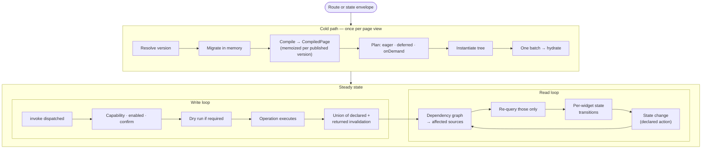
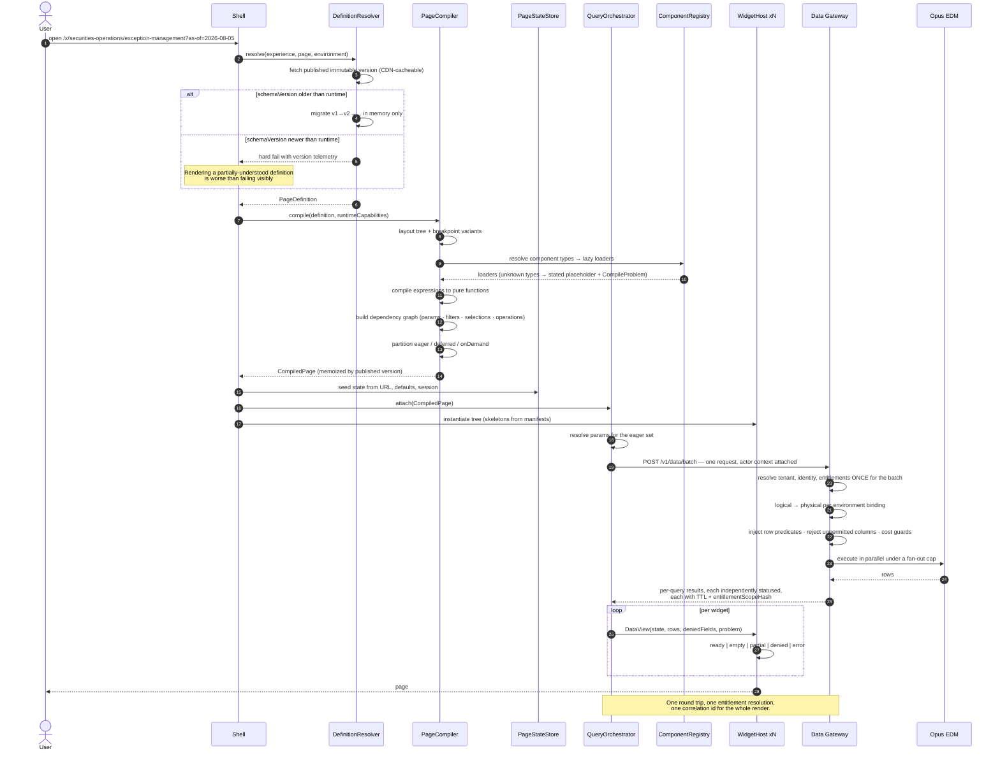
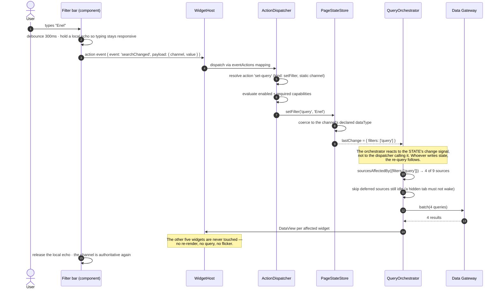
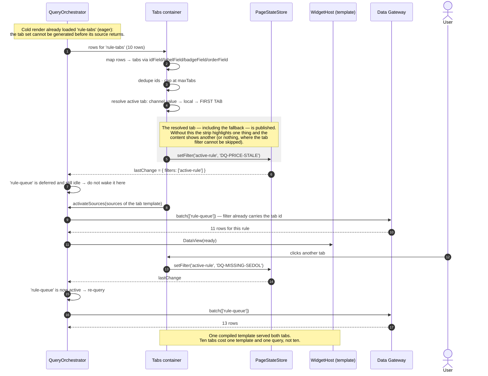
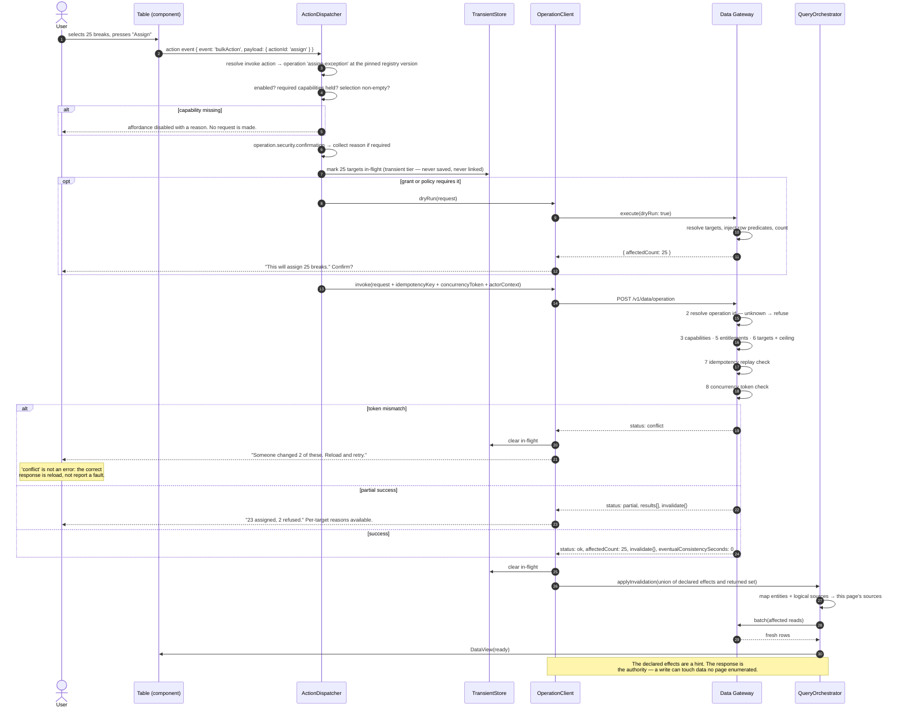
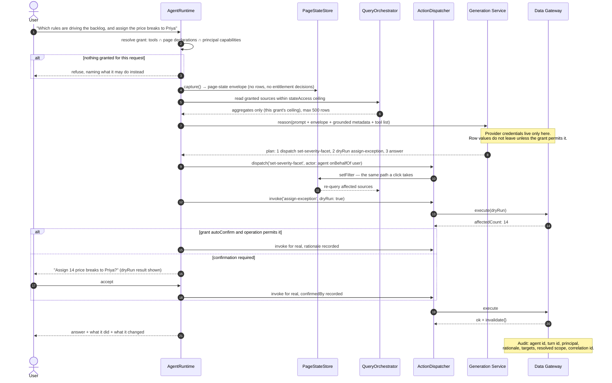

# How Are Pages Rendered?

Status: **Draft for approval**
Part of the [Core Runtime Specification](./00-index.md) · Answers question 5.
Companion: [`../runtime-architecture.md`](../runtime-architecture.md) specifies the eight pipeline stages and the failure matrix. This document specifies the **two steady-state loops** and gives the sequences.

---

## 1. The Shape of a Render

Rendering is one cold path and two loops. Getting the loops right is what separates a platform from a demo, because the cold path runs once and the loops run for the rest of the session.

The two loops meet at one point — the dependency graph — and that junction is the design. A write is not a special interaction with its own refresh logic; it is a state change whose invalidation set comes from the server instead of from the compiler.

---

## 2. Cold Render

Three properties of this sequence are decisions rather than mechanics:

**Compilation is memoized by published version, and only by that.** An immutable published artifact cannot change under its key. A *draft* can — so a definition handed over in memory has no version identity at all and must bypass the cache unconditionally. This was learned the expensive way: a canvas frozen at the version first loaded, and a newly added data source that was never queried.

**Entitlements resolve once for the batch.** Twelve widgets issuing twelve requests would produce twelve entitlement resolutions, twelve audit events and head-of-line blocking on browser connection limits. Batching is not a latency optimization; it is what makes one audit record describe one render.

**Unknown types produce a placeholder and a `CompileProblem`, not a failure.** The problem travels with the compiled page so the Studio can show it as a finding and telemetry can attribute it to a definition version.

---

## 3. Read Loop — a Filter Change

The note in the middle is the design correction this specification makes explicit. `applyChange` had only ever been called by the dispatcher, which quietly made "re-query on change" a property of the *dispatcher* rather than of the *state*. That held while the dispatcher was the only writer — and then the renderer wrote a tab channel for chrome it owns, and the tab strip moved while its content did not. **An invariant enforced by one caller's discipline is not an invariant.**

---

## 4. Deferred Activation — Data-Driven Tabs

The sequence that makes detail pages affordable, and the one with the most failure modes per line.

Two ordering constraints are visible and both are real:

- **Publish the tab id before activating the template's sources.** Reversed, the first query runs with an empty channel and either returns everything or nothing, depending on `skipWhenEmpty`.
- **A deferred, idle source must not be woken by a state change.** Otherwise a filter change anywhere on the page starts queries for every hidden tab, and the deferral budget is spent by the first interaction.

---

## 5. Write Loop — an Operation

New with this specification. The mirror of §3, with four extra obligations: authorization, confirmation, concurrency and honest invalidation.

The steps that are easy to omit and expensive to add later:

| Step | Omitted consequence |
|---|---|
| Capability check *before* the request | The user presses a button and receives a server denial for something the UI should never have offered |
| Idempotency key | A retried assignment lands twice; the audit shows two decisions where one was made |
| Concurrency token | A silent overwrite of a colleague's change, discovered during a reconciliation |
| `expectedCount` on a filter-targeted write | The queue changed between read and write, and the user closes more than they were shown |
| Transient tier for in-flight state | Optimistic values leak into a saved definition or a shareable link |
| Union invalidation | Stale widgets after writes with unenumerated side effects — near-undiagnosable from a bug report |

---

## 6. Agent Turn

An agent turn is §3 and §5 again, with a grant check in front and an audit row behind. There is no third loop.

What the sequence deliberately does not contain: any arrow from the agent to the compiler, the registry, or EDM. The agent's reach is the dispatcher and granted reads. That is law **L6**, and it is checkable as a dependency rule rather than by reading prompts.

---

## 7. Failure Paths

The existing failure matrix covers reads. These are the additions, and each has a defined non-blank behaviour.

| Failure | Behaviour | Why this and not something else |
|---|---|---|
| Unknown operation id at the pinned registry version | Affordance rendered **disabled** with a stated reason; telemetry names operation and definition version | A button that produces a server refusal teaches users the platform is unreliable |
| Operation refused for missing capability | Affordance hidden or disabled per `deniedBehaviour`; never a failed request | Hiding what cannot be used is usability; the gateway still decides |
| `conflict` | Reload the target, re-offer the action, preserve the user's entered values | The user's input is not the thing that went stale |
| `partial` | Report counts and per-target reasons; re-query; leave the page usable | A bulk write's normal outcome |
| Background operation, no result yet | `accepted` state on the affordance; the view reports it is catching up | Better than a spinner that never resolves, or a false success |
| Write succeeded, `eventualConsistencySeconds > 0` | Report success **and** that the view is catching up; do not present the old value as new | Otherwise the user performs the write again |
| Agent budget exhausted mid-task | `escalate`: hand back what was done and what remains | Silent truncation, on the same rule the query planner follows |
| Agent grant references something the page no longer declares | Tool unavailable for this turn; agent says so; telemetry raises a stale-grant finding | A dangling grant must not resolve to "closest match" |
| Runtime lacks a capability the definition needs | Degrade per [`08-evolution.md`](./08-evolution.md) §3; warn at promote time | Discovering it in production means users find affordances that do nothing |

---

## 8. Performance Contract

| Budget | Mechanism | Enforced where |
|---|---|---|
| One round trip for first paint | Eager batch | Planner |
| No first-paint wait on below-the-fold widgets | Deferred activation on viewport intersection; skeletons from manifests | Planner + host |
| No query for a search page until input exists | `onDemand` predicate | Planner |
| No re-query of unaffected widgets | Static dependency graph | Compiler |
| No recompilation on interaction | `CompiledPage` memoized per published version | Compiler |
| Fan-out cap per page | `maxEagerDataSources`; excess **deferred, never dropped** | Planner + gateway |
| Write blast radius | `maxTargets`; `dryRun` | Registry + gateway |
| Agent cost | Tool-call, operation, token and turn budgets | Server-side |

Every one of these is observable per render, tagged with definition version, registry version and catalog version — so a regression is attributable to a change rather than to a feeling.

---

## 9. Decisions Requiring Ratification

| # | Decision | Consequence if reversed later |
|---|---|---|
| R1 | Two steady-state loops meeting at one dependency graph | Writes acquire their own refresh logic, which every page then hand-wires |
| R2 | The orchestrator reacts to the state's change signal, not to its callers | A second state writer silently stops re-querying |
| R3 | Compilation memoized by *published* version only; in-memory definitions bypass the cache | Frozen canvases; data sources that are never queried |
| R4 | The resolved active tab — including the first-tab fallback — is published to its channel | Tab strips that disagree with their content |
| R5 | A deferred idle source is never woken by an unrelated state change | The deferral budget is spent by the first interaction |
| R6 | Capability and confirmation are checked before a write request is made | Users meet server denials for affordances the UI offered |
| R7 | Invalidation after a write is the union of declared and returned sets | Stale data after side-effecting writes |
| R8 | In-flight write state lives in the transient tier only | Optimistic values reach saved artifacts and shared links |
| R9 | An agent turn uses the dispatcher and the orchestrator, with no private path | The privileged path becomes the breach path |
| R10 | Every failure has a defined non-blank behaviour, including the write-side ones | Blank widgets, false successes, and duplicated writes |
