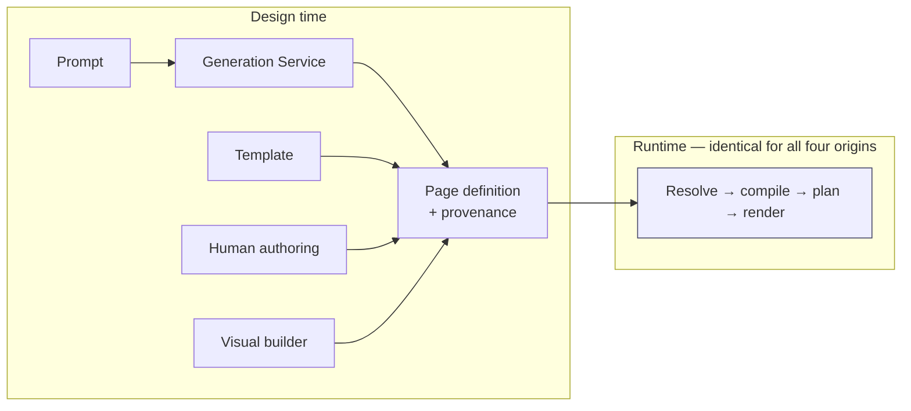
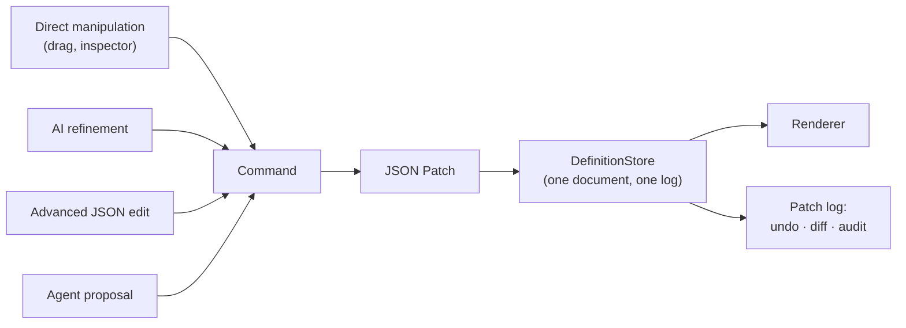
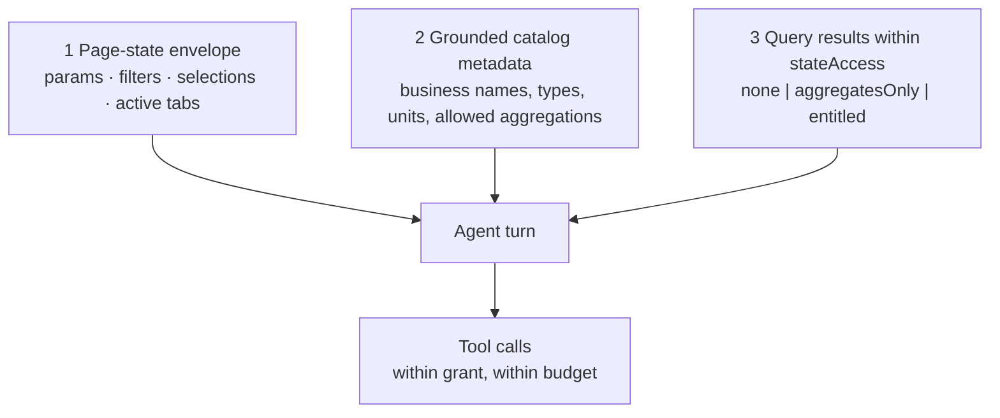

# How Are AI-Generated Pages Represented? — and How Agents Fit

Status: **Draft for approval**
Part of the [Core Runtime Specification](./00-index.md) · Answers question 6.
Introduces: [`../../schemas/agent.schema.json`](../../schemas/agent.schema.json) · example: [`../../schemas/examples/exception-triage.agent.json`](../../schemas/examples/exception-triage.agent.json)

---

## 1. The Answer to Question 6

> **An AI-generated page has no runtime representation of its own. It is an ordinary page definition with a `provenance` block, rendered by the same code path as a hand-authored one.**

That is the entire answer, and the sparseness is the achievement rather than an omission. Everything below explains why any other answer would be worse.



Four origins, one artifact type, one render path. A generated page is not a second-class artifact, is not marked at render time, and gets no special handling — because the moment the runtime could tell the difference, it could behave differently, and then a generated page would need its own testing, its own support story and its own failure modes.

### What `provenance` carries, and who reads it

| Field group | Read by |
|---|---|
| `origin` (`human` · `ai` · `aiRefined` · `template` · `import` · `migration` · `copy`) | Governance UI, audit, quality metrics |
| `prompt`, `intentClass`, `promptTemplateVersion` | Reviewer asking "why does this page look like this" |
| `modelId`, `modelVersion`, `temperature` | Reproduction, and attribution when quality regresses |
| `retrievedConcepts`, `exemplarTemplateIds` | Evaluation harness; leak investigation |
| `validationAttempts`, `repairedStages`, `fallbackUsed` | Generation quality measurement |
| `editSummary.patchOperationCount` | The truest quality signal: how much a human had to correct |

**None of it is read by the renderer.** Provenance is governance data attached to a version, not an input to rendering. If it were an input, law **L1** would be broken by the artifact rather than by the code.

---

## 2. Why Design-Time Generation Is a Runtime Decision

The choice looks like an AI-architecture decision. It is a *runtime* decision, because it is what buys every property in the table:

| Property | Because generation is design-time |
|---|---|
| **Determinism** | Same definition, identity and data → same view. Testable, screenshottable, reproducible from a defect report |
| **Latency** | Seconds are acceptable while authoring; a render must not wait on a provider |
| **Cost** | Paid once per authoring session, not once per page view per user |
| **Outage independence** | A provider incident degrades authoring and cannot break a published dashboard |
| **Governance** | Model output is a reviewable artifact under version control, not an unreviewed answer shown to a user |
| **Auditability** | Provenance attaches to a stored version and survives indefinitely |

Reversing this — generating layout or bindings at render time — would forfeit all six at once. It is decision **RC8**'s premise and the reason runtime AI must arrive as something other than a renderer.

---

## 3. Generation Is a Patch Producer

In refine mode the model returns a **JSON Patch** against the current definition, not a document. This is the mechanism that makes AI refinement trustworthy, and it aligns the model with the visual builder and the server's patch endpoint — one representation, three producers:



Four consequences, all of which a whole-document regeneration loses:

- **Manual edits survive by construction.** The patch touches only what the request concerns.
- **Changes are reviewable.** Three operations can be understood and accepted; a regenerated document cannot.
- **Undo is free.** The inverse patch already exists, and works identically for a drag and for a refinement.
- **The definition is the memory.** No chat transcript is carried forward, so context growth is bounded and the model reasons about the artifact's actual current state — including changes made by direct manipulation it never saw.

Patches are validated as *resulting documents*: apply to a candidate, run the full cascade against the result. A valid-looking patch cannot produce an invalid definition.

**One rule about assembly**, learned by getting it wrong: deterministic assembly carries the model's decisions faithfully and never corrects them. Clamping an illegal aggregation to a legal one in the assembler looks like defence in depth and is three defects at once — provenance becomes a lie, model error becomes invisible to the evaluation harness, and the validation cascade never runs because nothing invalid ever reaches it. A page may be assembled from wrong decisions and then rejected; it must not be silently rewritten into a right one.

---

## 4. Runtime AI: an Agent Is an Actor

Runtime AI is a genuine product requirement — an assistant that explains a queue, narrows it, and does the obvious work. The design question is where to put it such that §2's six properties survive.

> **An agent is an actor holding a grant. It may change page state and it may propose a patch. It may never emit markup, a query shape, or a component.**

That single restriction preserves law **L1** in the presence of runtime AI, and the argument is worth making precisely:

A render is `(definition, state, data, identity) → view`. A user's click changes **state**. An agent's dispatch changes **state**. Neither changes the function. So a page with an agent on it is still deterministic in the only sense that matters operationally: given the definition, the state, the data and the identity, the view is reproducible — and the agent's contribution to that state is recorded in the audit trail as a dispatch, exactly like a click.

If instead an agent could emit a widget, the view would depend on a model's output at render time. Determinism, testability, reproduction and outage independence would all go, and they would go quietly — the dashboard would keep working in the demo.

### 4.1 The four things an agent may do

| Capability | Grant kind | Effect | Human gate |
|---|---|---|---|
| Explain what is on screen | `explain` | None | None |
| Read a declared data source | `readDataSource` | None | Bounded by `stateAccess` and the principal's entitlements |
| Move the page | `dispatchAction` | Page state | Same `confirm` a user would face |
| Change data | `callOperation` | EDM write | `confirmation` policy; `dryRunFirst`; the operation's own agent ceiling |
| Change the definition | `proposeDefinitionPatch` | A **proposal**, not an edit | A human accepts the patch |

And the four things it may not do, stated as prohibitions because each is a plausible shortcut:

1. **Compose a query.** It reads *declared* sources. A model-authored query shape would bypass cost guards, `requiresFilter`, and the reviewability of what a page asks for.
2. **Emit or configure a component at runtime.** That is generation, and generation is design-time.
3. **Widen its own reach.** `instructions` is prompt content, not permission. Nothing in prose can add a tool.
4. **Act without a principal.** `onBehalfOf` is required, entitlements resolve against the principal, and the audit row names both.

### 4.2 Reach is an intersection, and each term removes a different failure

```
reach = grant ∩ page declarations ∩ principal capabilities ∩ EDM entitlements
```

| Term omitted | Failure |
|---|---|
| Grant | The agent can do anything its principal can — which is not what "triage the queue" means |
| Page declarations | The agent reaches past the page it is attached to, and reviewing the page stops telling you what can happen on it |
| Principal capabilities | The agent becomes a privilege escalation path |
| EDM entitlements | All of the above is theatre, because the client computed it |

The first three produce a *refusal a user can understand* ("this assistant may not waive breaks"); the fourth produces `denied`. Collapsing them would make every refusal indistinguishable, and the difference matters: one is a grant to widen, the other is an entitlement question for EDM.

---

## 5. The Agent Artifact

`schemas/agent.schema.json`. An agent is an authored artifact under the same lifecycle as a page: versioned, reviewed, published, promotable, revocable.

| Block | Decides |
|---|---|
| `kind` — `assistant` · `monitor` · `operator` | The runtime's obligations. An assistant proposes; a monitor observes and may never write; an operator may act within its grant and is the only kind that can act unattended |
| `surface` + `attachedTo` | Which pages it can see. A dangling reference is a validation error, not a "closest match" |
| `tools` | The enumerable blast radius. This is what a reviewer reads |
| `stateAccess` | What it may read: `none` · `aggregatesOnly` · `entitled`, with `maxRows` and a `sensitivityCeiling` **below** the principal's reach where appropriate |
| `egress` | What may leave for a provider. Row values off by default |
| `humanInLoop` | Where the human sits. Required, because a default here would be a policy decision made by omission |
| `budget` | Tool calls, operations, tokens, turns, duration — enforced server-side, because a client-side budget is a suggestion |
| `trigger` | User request, schedule, domain event, page open. Event triggers are how a monitor reacts to a write without polling |
| `observability` | Rationale, tool calls, and whether the reasoning transcript is retained — retention has a discovery cost as well as a privacy cost, so it is a declared choice |

Two validation rules do most of the safety work, and both are semantic rather than structural:

1. **Every tool must reference something declared.** A grant naming a data source, action or operation that does not exist at the pinned versions is rejected. This is what prevents an agent from being handed a capability the platform does not have.
2. **A grant cannot exceed the operation's own ceiling.** `autoConfirm: true` on a `callOperation` grant is refused unless the registry entry permits it, and `maxTargets` is clamped to the registry's. So a steward's judgement about a write — reversible? idempotent? destructive? — is enforced once, in the registry, rather than re-litigated in every agent.

---

## 6. What an Agent Sees

Three inputs, in ascending order of sensitivity, and the order is a design constraint rather than an observation.



**The state envelope, not the rendered page.** Handing an agent the DOM would make its behaviour depend on presentation, would be unbounded in size, and would carry data the grant may forbid. The envelope is bounded, reviewable, and free of rows by construction.

**Metadata before data.** The default egress posture is catalog metadata only — the same rule generation follows. Aggregates next; record-level values only where the grant says so and never above the sensitivity ceiling.

**Client-authored content is data, never instruction.** Exception descriptions, investigator notes and override comments are delimited and marked untrusted in the agent's context. The structural defence is the same one that protects generation: the agent's output is a *tool call against a declared grant*, so a successful injection can at worst request something the grant already permits — and a request outside the grant is refused before it reaches the gateway.

---

## 7. Audit

An agent action's audit row is a user action's row plus four fields — and the reason to add them now rather than later is that every audit consumer is built against this shape.

| Field | Why |
|---|---|
| `actor.kind` = `agent`, `actor.agentId` | Which agent, at which version |
| `onBehalfOf` | The human accountable for the action |
| `turnId` | Groups a decision with its consequences, so a reviewer sees them together |
| `rationale` | Why, in the agent's own words. Recorded verbatim; read as data |
| `confirmedBy` | Present when a human gated it — evidence rather than assertion |

The requirement this supports is the existing one, extended: a reviewer must be able to reconstruct, for any page in production, *who asked for it, what prompt and model produced it, what catalog it was bound against, who approved it, when it was promoted, every query it has issued, and every change any actor has made through it* — from the audit trail alone.

---

## 8. Why This Needs No Kernel Change

| Agent need | Mechanism | Already existed? |
|---|---|---|
| Read the page's data | `QueryOrchestrator` views | Yes |
| Know what the user is looking at | Page-state envelope | New artifact (A3) |
| Change the view | `ActionDispatcher` | Yes |
| Change data | `invoke` → operation registry | Reserved seam + A1 |
| Change the definition | JSON Patch to the definition store | Yes |
| Be bounded | Agent artifact grant | New artifact |
| Be attributed | `ActorContext` | New field (A2) |
| Be budgeted | Server-side budget enforcement | New enforcement, existing pattern |

Two new artifact types and one new request field. No new interpreter path, no second render path, no privileged transport. That is the closure claim of [`00-index.md`](./00-index.md) §5 for the fourth application class, and the falsifier is the same: if an agent needs a request path the gateway authorizes differently, this design has failed.

---

## 9. Decisions Requiring Ratification

| # | Decision | Consequence if reversed later |
|---|---|---|
| AI1 | A generated page is an ordinary definition plus provenance; the renderer cannot tell the difference | Generated pages need their own testing, support and failure modes |
| AI2 | Generation stays design-time; no model call in the render path | Determinism, latency, cost, outage independence, governance and auditability all go at once |
| AI3 | Refinement emits a JSON Patch through the same store as manual edits | Manual edits get overwritten; undo and review degrade |
| AI4 | Assembly carries model decisions faithfully and never corrects them | Provenance lies, evaluation goes blind, and the validation cascade stops being reached |
| AI5 | An agent is an actor: it may change state or propose a patch, never emit view | Runtime AI silently costs the platform determinism |
| AI6 | Agent reach is a four-way intersection, computed platform-side | An agent becomes a privilege escalation path |
| AI7 | An agent's grant cannot exceed an operation's registry ceiling | Stewardship judgements about writes get re-litigated per agent |
| AI8 | Agents read the state envelope, not the rendered page; metadata-first egress | Unbounded, presentation-coupled context and an uncontrolled egress path |
| AI9 | `onBehalfOf`, `turnId` and `rationale` are recorded from the first agent onward | Unattributable actions, and every audit consumer rewritten after the fact |
| AI10 | Agent budgets are enforced server-side | An unbounded cost and an unbounded blast radius |
