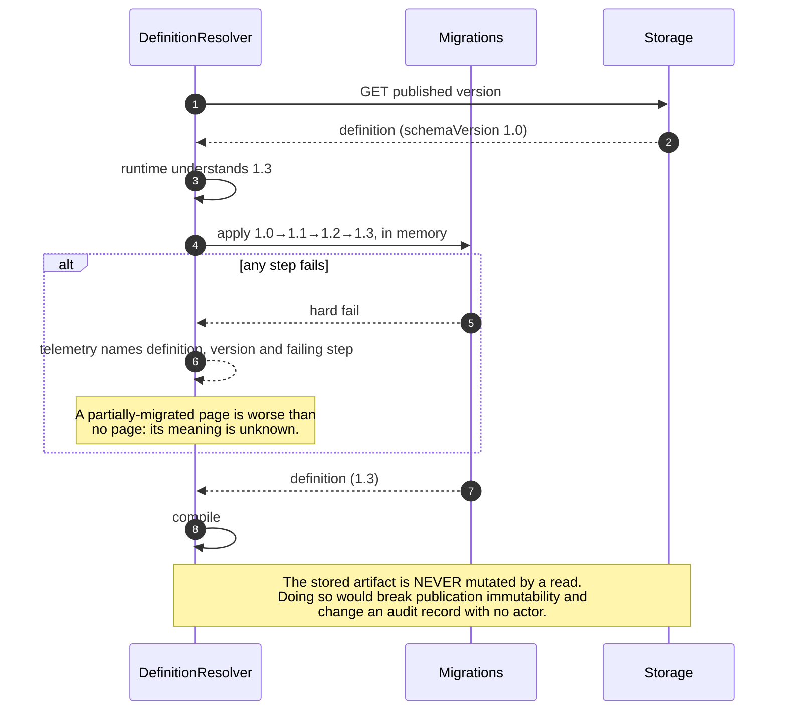
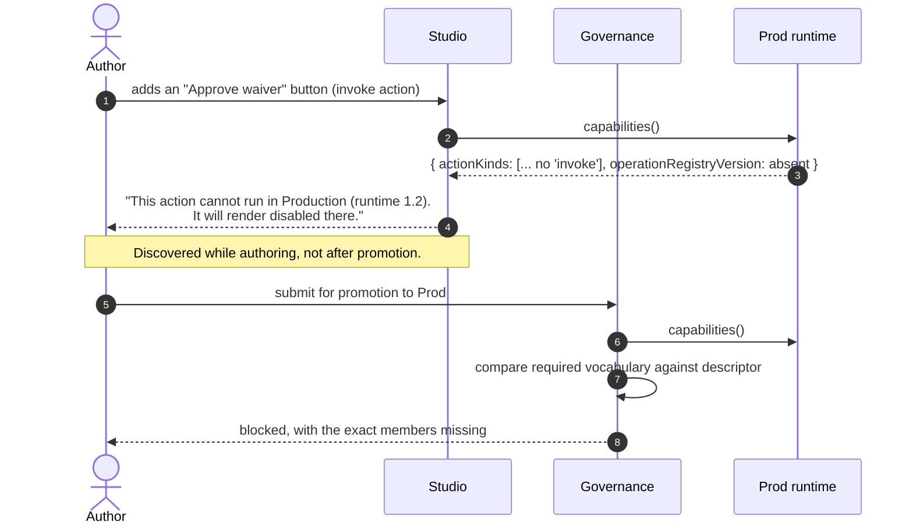

# How Can Pages Evolve Without Breaking Compatibility?

Status: **Draft for approval**
Part of the [Core Runtime Specification](./00-index.md) · Answers question 7.
Introduces: `runtime-contract.schema.json#/$defs/runtimeCapabilities`

---

## 1. The Problem, Stated Precisely

In three years this platform will hold tens of thousands of stored definitions, authored against a dozen catalog versions, a dozen registry versions, several schema versions, and several runtime versions — and any given render combines one of each. Compatibility is therefore not a policy about deprecation notices. It is a property the runtime must have:

> **A definition published against one set of contract versions must render, or degrade legibly, against a later runtime — without being rewritten, and without its meaning changing.**

Two failure modes bracket the design. **Hard failure** on anything unfamiliar makes every additive platform change an outage. **Silent tolerance** is worse: a page that quietly does less than it claims, discovered by a user who trusted a number.

The answer is five mechanisms. Four exist; the fifth is what this specification adds.

---

## 2. Five Mechanisms

| # | Mechanism | Handles | Status |
|---|---|---|---|
| 1 | **Four independent version axes** | Different things changing at different rates | Exists |
| 2 | **Immutable published versions** | A live page's meaning changing under it | Exists |
| 3 | **Lazy in-memory forward migration** | Old artifacts meeting a new runtime | Exists |
| 4 | **Additive-only vocabularies with closed-enum discipline** | New components, actions, operations | Exists |
| 5 | **A degradation contract with a published capability descriptor** | New *artifacts* meeting an old runtime | **New (A4)** |

Mechanism 5 is the missing direction. The first four handle old-artifact-meets-new-runtime; nothing handled new-artifact-meets-old-runtime except for unknown component types, which had a rule by accident of being noticed first.

### 2.1 The four version axes

Conflating any two produces bugs that are hard to diagnose later.

| Axis | Identifies | Changes when | Pinned by |
|---|---|---|---|
| `schemaVersion` | The contract an artifact conforms to | The metadata model changes | The artifact itself |
| `artifactVersion` | One saved state of one artifact | Any edit; immutable once published | The publication record |
| `pins` | The vocabularies it was authored against — `catalogVersion`, `registryVersion`, `operationRegistryVersion` | Never, for a given version | The version envelope |
| Component `version` | One component's contract | The component's properties change | Each instance's `typeVersion` |

Pinning is what makes a published page reproducible: same definition, same catalog, same component contracts, same write semantics. Without it, a steward renaming a measure changes what a live dashboard means — a change with no actor and no audit record.

`operationRegistryVersion` is the axis this specification adds, and it is additive: an optional property of `pins`, absent on every existing artifact, required only of an artifact that invokes an operation.

### 2.2 Migration is lazy, in memory, and never writes back

Migrations are pure, ordered, chained, and shipped with fixtures in both shapes. A background job may rewrite old versions as an explicit audited maintenance action — never as a side effect of someone opening a page.

---

## 3. The Degradation Contract

Law **L7**: an unknown vocabulary member degrades visibly. Not just an unknown component — **every** axis. The matrix is the specification.

| Unknown | Degradation | Why not fail, why not skip |
|---|---|---|
| **Component type or version** | Stated placeholder in the widget's slot; rest of the page renders; telemetry names type and definition version | Registry/definition skew is normal in a versioned platform. A blank page makes it look like an outage |
| **Container type** | Render children in a vertical stack, with a stated notice on the container | Children are the content. Losing the arrangement is a presentation regression; losing the content is a data regression |
| **Tab source mode** | Render declared/pinned tabs only, and state that generated tabs are unavailable | Silently showing three of eleven vendor tabs is a page that lies about completeness |
| **Action kind** | Affordance rendered **disabled** with a stated reason; never hidden, never inert | A hidden affordance makes the page look complete; an inert one makes it look broken. Disabled-with-a-reason is the only honest option |
| **Data source kind** | Widget in `error` with an author-actionable message; page shell intact | It cannot be approximated: a `graph` source answered as a `list` returns wrong data confidently |
| **Load policy** | Fall back to `deferred` — the conservative direction | Falling back to `eager` could scan a universe on open. Erring toward less work is always the safe direction for an unknown policy |
| **Expression function** | Expression evaluates to `null`; the widget shows its `emptyValue`; telemetry names the function | Guessing a function's semantics is how a threshold silently inverts |
| **Operation id or registry version** | Affordance disabled with a stated reason; **never** attempted | An attempted unknown write is the one degradation that could change data |
| **Agent tool grant** | Tool unavailable for the turn; the agent says so; stale-grant finding raised | A "closest match" tool is an unbounded agent |
| **`schemaVersion` newer than the runtime** | Hard fail, loudly, with version telemetry | This is the one case where failure is correct: the artifact's own contract is not understood, so nothing about it can be trusted |
| **Unknown property inside a known object** | Rejected at validation; at runtime, ignored with telemetry | Closed objects are why a hallucinated property fails loudly at authoring time. At runtime the artifact already passed, so this indicates skew, not invention |

Three principles generalize the matrix, and they are what to apply to an axis not listed:

1. **Content outranks arrangement.** When in doubt, show the data in a plainer container.
2. **Degrade toward less work, never more.** An unknown policy or budget resolves conservatively.
3. **Never approximate semantics.** Presentation may be approximated. Meaning may not — an unknown aggregation, function or data source kind must refuse rather than guess.

---

## 4. The Capability Descriptor

`runtimeCapabilities` is a runtime version's declaration of what it can execute: schema versions, container types, tab source modes, action kinds, data source kinds, load policies, expression functions, registry version and component types, operation registry version, which validation levels actually run, and which agent surfaces are supported.

It has three consumers, and the first is the one that changes the platform's character.

| Consumer | Uses it to |
|---|---|
| **Studio** | Warn at authoring time, and mark affordances that will degrade in a given environment |
| **Governance** | Block a promotion whose target cannot execute the artifact, naming the missing members |
| **Generation** | Constrain the emit vocabulary to what the target environment runs, so a generated page is not born degraded |

The descriptor also reports **which validation levels actually run**, and that honesty is deliberate. A runtime that claims level 6 without a cost estimator is worse than one that admits the gap, because a reviewer reads the claim and stops asking. Today the truthful answer is: levels 1, 2, 3, 4 and 7 run; 5, 6 and 8 do not.

---

## 5. What Is Additive and What Is Breaking

The rules already exist in `versioning.schema.json`; this restates them with the runtime's obligations attached.

| Change | Class | Runtime obligation |
|---|---|---|
| A new optional property | Additive | Ignore it when unknown; report via telemetry |
| A new component type | Additive | Placeholder until the registry has it |
| A new action kind | Additive | Disabled affordance with a reason |
| A new operation | Additive | Disabled affordance; never attempted |
| A new member of an **open** enum | Additive | Validate against the registry, degrade per matrix |
| A new agent tool kind | Additive | Tool unavailable; the agent says so |
| Removing or renaming a property | **Breaking** | Migration required |
| Making an optional property required | **Breaking** | Migration required |
| Retyping a property | **Breaking** | Migration required |
| Adding a member to a **closed** enum | **Breaking** | Existing validators reject it, so old runtimes must be upgraded first |
| Changing the meaning of an existing field | **Breaking** | The most dangerous class, because no validator catches it |

The last row deserves its own note, since it is the one a schema cannot police. Redefining a field's semantics while keeping its shape produces artifacts that validate and mean something different — the failure that broke the breakpoint cascade before a direction was documented. **A semantic change is a breaking change even when the shape is identical**, and must be handled as a new field plus a migration rather than as a redefinition.

### 5.1 The four additions of this specification, classified

| Addition | Class | Effect on stored artifacts |
|---|---|---|
| `operation.schema.json` (new artifact type) | Additive | None. No existing artifact references it |
| `agent.schema.json` (new artifact type) | Additive | None |
| `page-state.schema.json` (new artifact type) | Additive | None. It describes state, not content |
| `runtimeCapabilities` (new contract `$def`) | Additive | None |
| `pins.operationRegistryVersion` (new optional property) | Additive | None. Absent on every existing artifact |
| `SourceDependencies.operations` (compiled model) | Internal | None. Derived, never stored |

Every stored definition in the repository stays valid, which is verified by `npm run validate` on every commit — and is the reason this specification could be written as an extension rather than a v2.

---

## 6. Component Contract Evolution

The axis that moves most often, and the one where an unsafe habit is easiest to acquire.

| Change to a component | Allowed within a major version? | Mechanism |
|---|---|---|
| New optional config property | Yes | Generated types keep manifest and implementation in step |
| New optional slot | Yes | Renderer ignores absent slots |
| New emitted event | Yes | Pages map events they know about |
| New supported state | Yes | Six are mandatory; more is additive |
| Removing or retyping a config property | No | Major version; migrate definitions or register both versions in parallel |
| Changing what a property *means* | No | Same as above — see §5's last row |

Two supporting mechanisms make this safe rather than merely stated:

- **Impact analysis is a first-class query.** `?component=analytics.kpi-card@2` answers "what breaks if we deprecate this", which is the question that makes component evolution possible at all. It requires indexing into definition JSON, which is why the storage model uses GIN-indexed `JSONB` rather than a document store.
- **Deprecation is data, not a comment.** `lifecycle.deprecatedIn`, `replacedBy` and `migrationNote` are manifest fields, so the Studio can surface a replacement path and the generator can stop emitting the old type without anyone editing a prompt.

---

## 7. Evolution of the New Vocabularies

Operations and agents will change more often than the page schema. Their evolution rules, stated before they have any history:

| Change | Class | Note |
|---|---|---|
| A new operation | Additive | Requires a registry version bump; pages pin the version they were authored against |
| A new optional operation parameter | Additive | Existing invocations remain valid |
| A required new parameter on an existing operation | **Breaking** | A new operation id is correct; mutating the old one changes what a published page does |
| Narrowing `maxTargets` or tightening `confirmation` | Additive *in the safe direction* | Refusal is legitimate; a published page's button may become confirm-gated |
| Widening an operation's `agent.autoConfirm` | **Breaking, and reviewable** | It changes what existing agent grants may do unattended, so it is a governance change rather than a schema one |
| A new agent tool kind | Additive | Old runtimes report the tool unavailable |
| Widening an agent's grant | Additive to the agent, **material to governance** | A grant diff is the reviewable unit: "this agent gained the ability to reassign exceptions" |

The asymmetry in rows 4 and 5 is the important one. **Tightening is additive; loosening is a governance event.** An operation that becomes more cautious can be published freely; one that becomes less cautious changes the meaning of every grant that already references it, and must be reviewed as such.

---

## 8. Reproduction Contract

The end state all seven mechanisms serve. Given a defect report, a support engineer must be able to reproduce a render exactly from five artifacts — and every one of them is addressable by identifier today except the third, which is what mechanism A3 adds:

| # | Artifact | Where it comes from |
|---|---|---|
| 1 | Definition version | The publication record — immutable |
| 2 | Pins: catalog, registry, operation registry | The version envelope — immutable |
| 3 | Page state | The **page-state envelope** (A3) |
| 4 | Identity and resolved entitlement scope | The `entitlementScopeHash` on the query results |
| 5 | Data as of a moment | `asOf` / `knownAs` in the query result |

Five identifiers, one reproduction. That is what "governed" means operationally, and it is only achievable because nothing in the render path is nondeterministic — no model, no ambient state, no component fetching something of its own.

---

## 9. Decisions Requiring Ratification

| # | Decision | Consequence if reversed later |
|---|---|---|
| V1 | Four independent version axes, never conflated | Bugs whose cause is a version relationship nobody modelled |
| V2 | Published versions immutable; pins make renders reproducible | A live page's meaning changes with no actor and no audit record |
| V3 | Lazy in-memory forward migration; stored artifacts never mutated on read | Publication immutability and audit integrity both break |
| V4 | One degradation contract covering every vocabulary axis (L7) | Skew is discovered in production, one axis at a time |
| V5 | Degrade toward content, toward less work, and never approximate semantics | Silently wrong numbers rather than visibly missing features |
| V6 | Unknown operations are never attempted | The one degradation that could change data |
| V7 | A published capability descriptor, checked at authoring and at promotion | Authors discover incompatibility from users |
| V8 | The descriptor reports which validation levels actually run | Reviewers trust a claim and stop asking |
| V9 | A semantic change is breaking even when the shape is identical | Artifacts that validate and mean something else |
| V10 | Tightening an operation is additive; loosening it is a governance event | Every existing agent grant silently gains reach |
