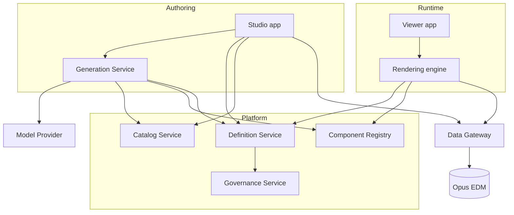

# System Overview

Entry point for the Opus Experience Studio architecture. Start here.

---

## 1. Architecture Vision

Opus Experience Studio is a **metadata-driven experience platform**: pages, components, data bindings, navigation and behaviour are declared as JSON definitions rather than written as code. Business users author those definitions through natural language and visual design; the platform renders them deterministically over governed EDM data.

The platform's centre of gravity is therefore the **definition** — the artifact that is generated, reviewed, versioned, promoted, audited, and interpreted. Every subsystem is either a producer of definitions, a consumer of definitions, or a governor of them.

---

## 2. Document Map

| Document | Covers |
|---|---|
| [`architecture-review.md`](./architecture-review.md) | Pre-implementation review: vision understanding, 15 gaps, 7 recommendations |
| [`implementation-roadmap.md`](./implementation-roadmap.md) | Nine milestones with demonstrable exit criteria |
| [`frontend-architecture.md`](./frontend-architecture.md) | Angular structure, component framework, state management, rendering engine |
| [`backend-architecture.md`](./backend-architecture.md) | Service decomposition, APIs, storage model, reliability |
| [`ai-architecture.md`](./ai-architecture.md) | Prompt processing, metadata retrieval, context management, generation flow, evaluation |
| [`runtime/`](./runtime/) | **Core Runtime Specification** — what an Experience, Page, Component and Data Source *are*; how workflow applications and AI agents fit without a new execution path. Object model, sequence diagrams, four new schemas |
| [`runtime-architecture.md`](./runtime-architecture.md) | How a JSON definition becomes a running application — the eight pipeline stages and the failure matrix |
| [`security-architecture.md`](./security-architecture.md) | Roles, permissions, entitlement enforcement, tenant isolation, threat model |
| [`ai-generation-architecture.md`](./ai-generation-architecture.md) | Superseded by `ai-architecture.md` |
| [`../schemas/README.md`](../schemas/README.md) | The core metadata model: ten models, three proposed runtime-core models, JSON schemas, worked examples |
| [`../schemas/expression-grammar.md`](../schemas/expression-grammar.md) | Expression language specification |
| [`../docs/M1-IMPLEMENTATION.md`](../docs/M1-IMPLEMENTATION.md) | Milestone 1 implementation record: what was built, verified, deviated and deferred |

---

## 3. Subsystems



| Subsystem | Responsibility |
|---|---|
| **Semantic Catalog** | The governed business vocabulary over EDM. Grounds both human authoring and AI generation |
| **Component Registry** | Versioned component manifests — the vocabulary definitions may reference |
| **Definition Service** | Authoring, immutable versioning, patch history, templates |
| **Generation Service** | Natural language → validated definition. Design-time only |
| **Rendering Engine** | Definition → live Angular page. Fully deterministic |
| **Data Gateway** | The single path to EDM. Enforces entitlements on every query |
| **Governance Service** | Lifecycle, approvals, promotion, immutable audit |

---

## 4. Principles

Product principles (from `CLAUDE.md`): AI first · reusable components · enterprise scalability · responsive by default · strong governance.

Architectural principles established across the documents above:

| # | Principle | Where |
|---|---|---|
| 1 | The definition is the contract; every subsystem binds to it | Review §R1 |
| 2 | Deterministic rendering — no model call in the render path | Runtime §1 |
| 3 | A definition is intent, never a security boundary | Security §1 |
| 4 | One enforcement point for all EDM access | Security §1 |
| 5 | Platform authorization and data authorization are orthogonal; Studio never widens access | Security §2 |
| 6 | Immutable published versions; edits create new drafts | Backend §4.2 |
| 7 | Logical data sources bound per environment, so promotion is not a content edit | Runtime §12 |
| 8 | Component manifests are machine-readable contracts with four consumers | Frontend §3.2 |
| 9 | All change is a JSON Patch through one store, whether from a human or the AI | Frontend §4.3 |
| 10 | Generation quality is measured on a corpus and gated in CI | AI §7 |
| 11 | Every state change is a declared transition; every data change is a registry operation | Runtime spec L4, L5 |
| 12 | Every actor — user, schedule, agent — uses the same entry points and the same checks | Runtime spec L6 |
| 13 | Unknown vocabulary degrades visibly; it never blanks a page and is never silently dropped | Runtime spec L7 |

---

## 5. Sequencing

Build order is the review's central recommendation: **contracts → deterministic rendering → AI.**

```
M0 Decisions   M1 Contracts ✓   M2 Components   M3 Renderer + Gateway
M4 Builder     M5 Catalog       M6 AI + Eval    M7 Governance   M8 Hardening
```

M1 is delivered, including a working runtime proof of concept that renders the reference
definitions. M3's renderer exists; what M3 still owes is the real Data Gateway and the
entitlement enforcement that only a server can provide.

At M3 the platform is real: hand-authored JSON renders as a governed, entitled, responsive page. At M6 it becomes authorable in natural language. Reversing that order risks a compelling demo and an unshippable product. Detail and exit criteria: [`implementation-roadmap.md`](./implementation-roadmap.md).

---

## 6. Status

Architecture documents are **drafts pending approval**. Each ends with a table of decisions
requiring ratification; those tables are the intended agenda for architecture sign-off and
should become ADRs once accepted.

**Milestone 1 is implemented**: the deterministic runtime — application shell, rendering
engine, component framework, JSON page loader, five components — with a mock gateway in place
of the real data plane. What it verified, where it deviated, and what it deliberately left out
are recorded in [`../docs/M1-IMPLEMENTATION.md`](../docs/M1-IMPLEMENTATION.md).

Building it settled two open questions and found four defects that document review had not:
the breakpoint cascade direction, an expression sandbox escape, silent data loss from an
uncoerced date parameter, and a misplaced client/server split in filter resolution.
